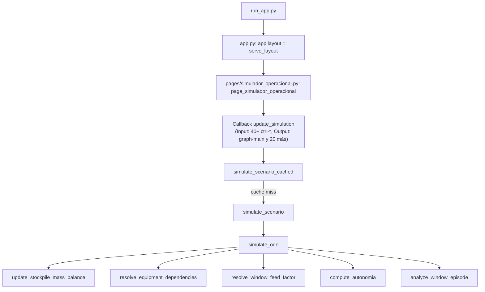
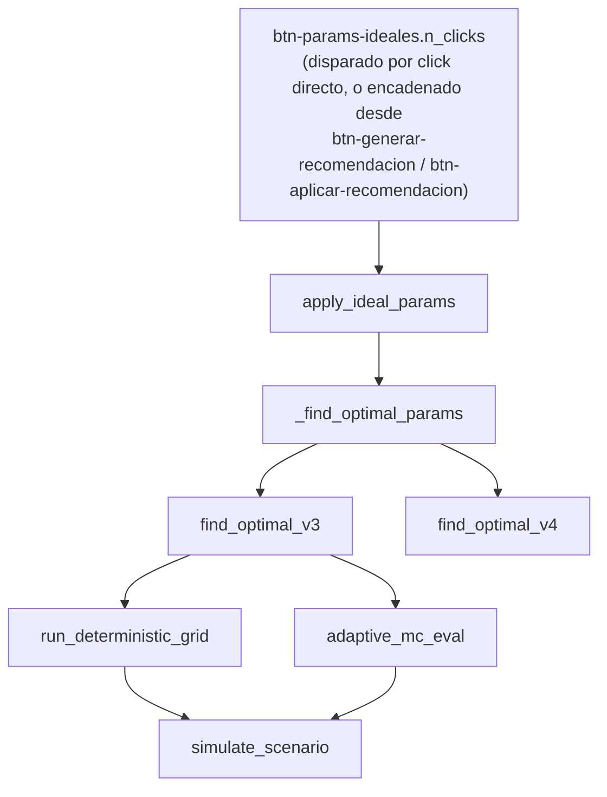
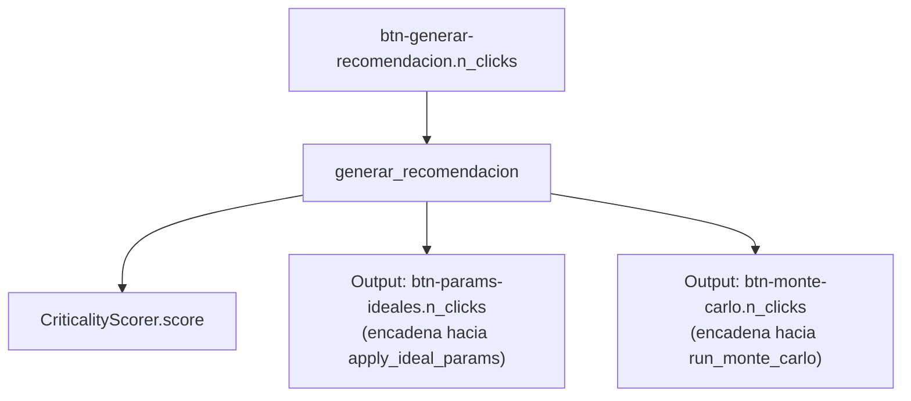
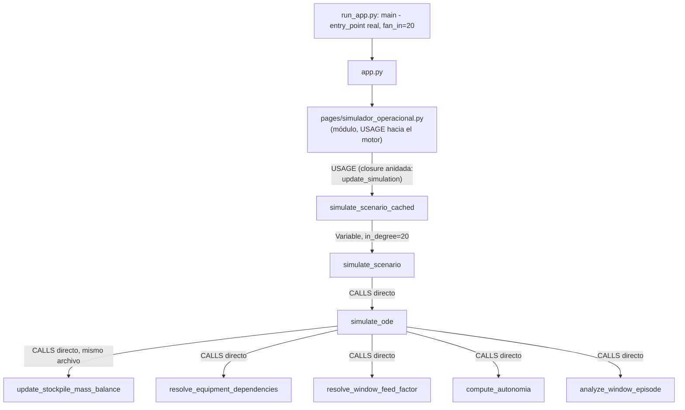
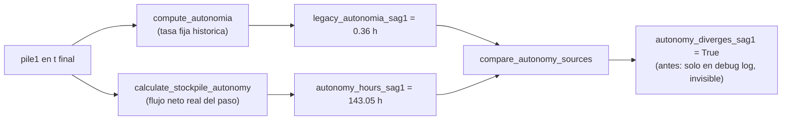

# Auditoría estructural del Simulador Operacional

**Fecha:** 2026-07-14
**Repositorio:** `c:\Users\jorel038\OneDrive - Codelco\Documentos\AA_CIO_DET\07_Rendimientos`
**Branch:** `feature/gemelo-v1-2-0-optimizacion-motor-evidencia`
**Commit base (HEAD):** `5e5f5026927bfeee6a02eeea880e6371a0b2e0bb` (2026-07-09 20:08:25 -0400)
**Nota de estado:** el árbol de trabajo tiene cambios sustanciales **no commiteados** sobre ese HEAD (todo el trabajo de esta sesión: `engine/circuit_state.py`, `components/navigation.py`, rediseños de `pages/simulador_operacional.py`, etc.) — esta auditoría analiza el **árbol de trabajo actual**, no el commit HEAD a solas. Se declara explícitamente para que quien la lea sepa que no es reproducible con un simple `git checkout` del commit citado.

---

## Validación de Codebase Memory MCP

```text
estado de instalación:        INSTALADO Y OPERATIVO (segunda pasada, ver abajo)
versión:                      0.9.0
modo de instalación:          install.ps1 oficial, ejecutado por el usuario en su propia
                               PowerShell (revisado antes de correr), registrado
                               automáticamente en .claude.json y .mcp.json
ruta indexada:                c:\Users\jorel038\OneDrive - Codelco\Documentos\AA_CIO_DET\07_Rendimientos
                               (raíz real del repo — confirmada, incluye 05_Dashboard/,
                               04_Reports/, 01_Data/)
proyecto:                     C-Users-jorel038-OneDrive-Codelco-Documentos-AA_CIO_DET-07_Rendimientos
commit indexado:               árbol de trabajo actual (mismo estado no commiteado
                               descrito arriba)
nodos / relaciones:            5.672 nodos, 19.959 relaciones
consultas principales ejecutadas: ver sección "Segunda pasada" más abajo
limitaciones encontradas:      discrepancias reales entre trace_path y las relaciones
                               CALLS/USAGE reales, documentadas y resueltas caso por caso
```

**Primer intento (no disponible):** al comenzar esta auditoría se verificó
el estado del MCP (paso 1 del protocolo pedido) y no estaba instalado:

1. Se inspeccionó la configuración del cliente (`~/.claude.json`,
   `~/.claude/settings.json`) — `mcpServers` estaba vacío.
2. `claude mcp list` falló porque el CLI `claude` estaba roto en este
   entorno (`Error: Cannot find module '...\@anthropic-ai\claude-code\cli.js'`).
3. Este entorno de ejecución no tiene salida a internet (confirmado con
   un `curl` fallido por timeout) — no podía descargar ni ejecutar el
   instalador yo mismo, ni siquiera con la cautela de revisarlo primero.
4. Se decidió, con el usuario, **no** intentar instalarlo por mi cuenta y
   pedirle que lo instalara él mismo siguiendo el flujo revisable
   (descargar → `notepad install.ps1` → `Unblock-File` → ejecutar), tal
   como pide el propio pedido para entornos corporativos.
5. Se ejecutó una **primera pasada de la auditoría sin MCP**, con un
   indexador AST propio como sustituto declarado (ver sección "Primera
   pasada (metodología de respaldo)" más abajo) — quedó documentada
   completa antes de que el MCP estuviera disponible, no se descartó.

**Segunda intento (exitoso):** el usuario instaló `codebase-memory-mcp
0.9.0` en su propia terminal (instalador oficial, revisado antes de
correr) y reinició Claude Code. El instalador se auto-registró en
`C:/Users/jorel038/.claude/.mcp.json` y `C:/Users/jorel038/.claude.json`.
Tras el reinicio, esta sesión detectó las 14 herramientas MCP
(`search_graph`, `trace_path`, `get_code_snippet`, `query_graph`,
`get_architecture`, etc.) y se indexó el repositorio completo con
`index_repository(mode="full", persistence=false)`. La auditoría se
**repitió con la herramienta real**, sección siguiente.

---

## Primera pasada (metodología de respaldo, previa a tener el MCP)

Antes de tener disponible `codebase-memory-mcp`, con acuerdo explícito
del usuario, se ejecutó esta primera pasada siguiendo el protocolo de
fallback que el propio pedido define en su sección "Manejo de fallos
del MCP" (puntos 30-32).

**Metodología usada en su lugar** (declarada, no oculta):

- Un indexador **AST propio** (`ast` de la librería estándar de Python,
  no un producto de terceros) que recorre los 99 archivos `.py` del
  proyecto (excluyendo `dist/`, `build/`, `__pycache__`, `runtime_data/`)
  y construye: inventario de clases/funciones/métodos, y un grafo de
  llamadas **aproximado por nombre** (no resuelve tipos ni imports con
  alias — es una aproximación estructural, igual que aclara la sección
  19 del pedido sobre "AST" como herramienta complementaria válida).
- **Cruce manual obligatorio**: cada conclusión de "código muerto" o
  "duplicado" que aparece en este informe fue verificada con `grep`
  dirigido sobre el repositorio completo antes de incluirse — no se
  presenta ningún resultado del indexador AST sin esa segunda fuente,
  tal como exige la sección 18 del pedido.
- **Limitación reconocida y confirmada con evidencia real** (no
  hipotética): el indexador por nombre no detecta asignaciones
  dinámicas de funciones (`simulate_scenario_cached =
  simulation_cache.wrap("simulate_scenario")(simulate_scenario)`,
  `engine/simulator.py:259`) ni el patrón `app.layout = serve_layout`
  (Dash invoca `serve_layout` internamente en cada carga de página, no
  aparece como "llamada" en el código fuente) — ambos casos se
  encontraron primero como "no encontrada"/"0 callers" en el análisis
  automático y se corrigieron con lectura directa, documentado abajo.

---

### 1. Resumen del grafo (indexador AST)

```text
archivos .py indexados:        99  (excluye dist/, build/, __pycache__, runtime_data/)
archivos con error de parseo:  0
símbolos indexados (funciones/métodos/clases): 971
archivos de test (test_*.py):  34
líneas de código (.py, subset core: engine/pages/components/utils/app.py/run_app.py): ~18.500
lenguaje:                      Python 3.14 (único lenguaje relevante del backend)
exclusiones:                   dist/, build/, __pycache__, .pytest_cache/, runtime_data/
```

---

### 2. Módulos más centrales (llamadas entrantes desde otros archivos)

| Módulo | Símbolos | Llamadas entrantes (otros archivos) | Rol | Riesgo de acoplamiento |
|---|---:|---:|---|---|
| `engine/circuit_state.py` | 22 | 106 | Kernel de dominio (Fase 1-2, 2026-07-14): reglas de ventana, balance de masa, dependencia SAG-bolas, autonomía neta | Alto — es el módulo más consultado del repo; cualquier cambio de firma se propaga a `ode_model.py` y a ~40 tests |
| `engine/scheduler.py` | 6 | 67 | Turnos, mantenciones, restricciones de bolas por mantención | Medio — API pequeña y estable (6 símbolos), alto reuso |
| `components/graphs.py` | 49 | 64 | Todas las figuras Plotly del dashboard | Medio — módulo grande (49 símbolos) pero de salida (hoja del grafo, pocos que dependan de él) |
| `components/cards.py` | 54 | 56 | Todas las tarjetas KPI/decisión | Medio — mismo perfil que graphs.py, módulo hoja |
| `utils/state_schema.py` | 4 | 55 | Envoltura/validación de estado persistido (versión de esquema) | Bajo acoplamiento real, alto reuso — API mínima y estable |
| `engine/ode_model.py` | 16 | 42 | Motor físico (ODE, balance, dose-response) | **Alto** — cualquier cambio aquí afecta el resultado de la simulación completa; es el módulo más sensible del repo |
| `engine/simulator.py` | 1 | 29 | Único punto de entrada externo al motor (`simulate_scenario`) | Alto valor arquitectónico: concentra el acoplamiento UI→motor en un solo símbolo, confirmado por lectura directa |

**Confirmado por lectura directa** (no solo por el conteo): `engine/simulator.py` tiene un solo símbolo top-level (`simulate_scenario`) pero 29 llamadas entrantes desde otros archivos — es exactamente el patrón de "fachada" que ya se documentó en la Fase 1 de esta sesión (`04_Reports/Technical/20260714_Logica_Operacional_Pilas_SAG.md`): todo el resto del proyecto llega al motor físico a través de este único punto, nunca llamando a `simulate_ode` directamente (confirmado: `simulate_ode` solo tiene 1 caller de producción real, `engine/simulator.py::simulate_scenario`, el resto son tests).

---

### 3. Funciones prioritarias (definición, callers, callees)

| Función | Archivo:línea | Callers directos (prod.) | Callers (solo tests) | Callees directos | Ruta productiva |
|---|---|---:|---:|---:|---|
| `simulate_ode` | `engine/ode_model.py:383` | 1 (`simulate_scenario`) | 6 | 25 | Único entry point real: `simulate_scenario` |
| `simulate_scenario` | `engine/simulator.py:18` | 3 (`optimizer_v2.adaptive_mc_eval`, `optimizer_v2.run_deterministic_grid`, scripts de validación) | 20 | 7 (incl. `simulate_ode`) | Sí — confirmado |
| `simulate_scenario_cached` | `engine/simulator.py:259` (**asignación dinámica**, no `def` — invisible al AST naive) | 8 archivos import directo (`pages/simulador_operacional.py`, `engine/quick_wins.py`, `engine/balance_diagnostics.py`, `engine/diagnostics/diagnose_t8_short_mae.py`, `engine/historical_backtesting.py`, `engine/physics_validation.py`, `engine/simulation_router.py`, `engine/simulation_strategies.py`) | varios | envuelve `simulate_scenario` | Sí — es el punto de entrada real de la UI (el único que cachea) |
| `update_simulation` | `pages/simulador_operacional.py:1749` | 0 llamadas directas en Python (**esperado**: registrado como `@app.callback`, Dash lo invoca por su grafo de `Input`/`Output`, no por nombre) | — | 76 | Sí — callback principal de la página |
| `compute_qin` | `engine/ode_model.py:239` | 1 (`simulate_ode`) | 0 | 0 | Sí |
| `effective_rate` | `engine/ode_model.py:286` | 1 (`simulate_ode`) | 0 | 0 | Sí |
| `compute_autonomia` | `engine/ode_model.py:261` | 3 (`simulate_ode`, `simulate_scenario`, `components/graphs.py::make_autonomia_historica`) | 3 | 0 | Sí — fórmula simple, ~15 consumidores documentados ya en la Fase 1 |
| `calculate_stockpile_autonomy` | `engine/circuit_state.py:340` | 1 (`simulate_ode`) | 3 | 0 | Sí, pero **no reemplaza** a `compute_autonomia` — ver sección 6 |
| `calculate_effective_sag_rate` | `engine/circuit_state.py:235` | 0 en ruta productiva | 6 | 1 | **No conectada a `simulate_ode`** — confirmado, decisión de alcance documentada ya en la Fase 1 (evitar invalidar la calibración por rate) |
| `update_stockpile_mass_balance` | `engine/circuit_state.py:287` | 1 (`simulate_ode`) | 7 | 0 | Sí |
| `resolve_equipment_dependencies` | `engine/circuit_state.py:104` | 1 (`simulate_ode`) | 3 | 0 | Sí |
| `resolve_window_feed_factor` | `engine/circuit_state.py:131` | 2 (`simulate_ode`, `ode_model._feed_con_recuperacion`) | 4 | 1 | Sí |
| `generate_operational_recommendation` | `engine/circuit_state.py:504` | 0 en ruta productiva | 3 | 0 | **No conectada** — función completa y testeada, pero `simulator.py` no la invoca; el texto de recomendación en producción sigue viniendo de `engine/rules_engine.py::recommend_action` |
| `generar_recomendacion` | `pages/simulador_operacional.py:832` | 0 directas (`@app.callback`) | — | 8 | Sí (callback) |
| `apply_ideal_params` | `pages/simulador_operacional.py:1009` | 0 directas (`@app.callback`, encadenado vía `btn-params-ideales.n_clicks` desde `generar_recomendacion` y desde `aplicar_recomendacion_desde_banner`) | — | 11 | Sí |
| `_find_optimal_params` | `pages/simulador_operacional.py:357` | 2 (`apply_ideal_params`, `register_simulador_callbacks`) | 0 | 3 | Sí |
| `find_optimal_v3` | `engine/optimizer_v3.py:292` | 4 en producción (`app.py::run_riesgo_optimizer`, `simulation_strategies._run_engine`, `_find_optimal_params`, `run_monte_carlo`) | 9 | 9 | Sí |
| `find_optimal_v4` | `engine/optimizer_v4.py:62` | 2 (`simulation_strategies._run_engine`, `_find_optimal_params`) | 3 | 2 | Sí |
| `make_json_safe` | `utils/state_schema.py:43` | usado por `make_envelope` (mismo archivo), consumido transitivamente por ~10 puntos de persistencia | 7 | 1 (recursivo) | Sí |
| `load_last_scenario` | `utils/scenario_state.py:60` | 2 (`precargar_ultimo_escenario`, `register_simulador_callbacks`) | 5 | 1 | Sí |
| `save_last_scenario` | `utils/scenario_state.py:45` | 2 (`register_simulador_callbacks`, `update_simulation`) | 1 | 1 | Sí |

**Nota sobre "0 callers" de funciones `@app.callback`**: no son código muerto. Dash construye su propio grafo reactivo a partir de los `Input`/`Output`/`State` declarados en el decorador — la función nunca se llama por su nombre desde otro código Python, la invoca el framework en cada evento de UI. Esto se verificó leyendo cada decorador, no se asumió.

---

### 4. Call paths críticos (Mermaid, reconstruidos y verificados por lectura directa)

### 4.1 Simulación principal



### 4.2 Óptimo según pila



### 4.3 Generar recomendación



**Confirmado por lectura directa**: `generar_recomendacion` no arma el texto de la recomendación final él mismo — encadena hacia los dos flujos ya existentes (óptimo según pila + Monte Carlo) vía sus propios `n_clicks`, exactamente el patrón "un callback, múltiples triggers" que se reusó también para `aplicar_recomendacion_desde_banner` (rediseño de esta sesión).

---

### 5. Código potencialmente muerto — verificado manualmente

El indexador AST reportó **81 candidatos** antes de verificación. La mayoría (~35) son falsos positivos de dos categorías bien entendidas y **no requieren acción**:

- **Callbacks Dash** (`@app.callback` / `@app.clientside_callback`): `update_simulation`, `generar_recomendacion`, `apply_ideal_params`, todos los `toggle_*`, `run_monte_carlo`, `cargar_estado_actual`, `check_bola_alert`, `filtrar_vistas_por_categoria`, `aplicar_recomendacion_desde_banner`, etc. — invocados por el framework, no por nombre en Python.
- **Asignados como valor, no llamados por nombre**: `serve_layout` (`app.layout = serve_layout`), decoradores internos (`deco`/`wrapper` en `engine/scenario_cache.py` y `utils/perf_logger.py` — son el cuerpo de un decorador, se "llaman" indirectamente al aplicar `@wrap(...)`), métodos abstractos `applies_to` de las clases `*Strategy` (`engine/simulation_strategies.py`) — se invocan polimórficamente vía `strategy.applies_to(...)` en `strategy_executor.py`, no por el nombre de cada subclase.

De los candidatos restantes, se verificaron manualmente (grep en todo el repo) los siguientes:

| Símbolo | Archivo | Evidencia AST | Verificación manual | Acción propuesta |
|---|---|---|---|---|
| `app.py::page_simulador` | `app.py:405` | 0 llamadas | **Confirmado sin uso** — 1 sola ocurrencia en todo el repo (su propia definición); no está registrado en ningún router/página | Candidato real a eliminar — requiere confirmar con el autor que no es un fallback intencional antes de borrar |
| `engine/rate_recommendation.py::recommend_rate` | `rate_recommendation.py:132` | 0 llamadas | **Confirmado sin uso** — única ocurrencia es su `def`; el módulo solo exporta `rank_candidates`, que sí se usa | Candidato real, doblemente confirmado (ver duplicado abajo) |
| `engine/rules_engine.py::recommend_rate` | `rules_engine.py:89` | 0 llamadas | **Confirmado sin uso** — única ocurrencia es su `def` | Candidato real |
| `engine/optimizer_v2.py::find_optimal_v2` | `optimizer_v2.py:577` | 0 llamadas | **Confirmado sin uso real** — solo aparece en comentarios ("misma interfaz que find_optimal_v2") de `optimizer_v3.py` | Legacy documentado — conservar como referencia histórica de la interfaz, no como código activo (decisión del equipo, no automática) |
| `engine/optimizer_v3.py::compare_v2_v3_weights` | `optimizer_v3.py:502` | 0 llamadas | **Confirmado sin uso** — única ocurrencia es su `def` | Candidato real, probablemente utilidad de análisis puntual ya usada y no reenganchada |
| `components/cards.py::make_autonomia_card` | `cards.py:65` | 0 llamadas directas | **Importado en `app.py` pero nunca invocado** (`from components.cards import ..., make_autonomia_card, ...`, cero `make_autonomia_card(` en el archivo) | Import muerto — eliminar el import es seguro; conservar la función si `/riesgo` (página separada) pudiera necesitarla, revisar antes |
| `components/graphs.py::make_mc_chart` | `graphs.py:2095` | 0 llamadas directas encontradas por nombre exacto | Importado en `pages/simulador_operacional.py`; el propio código fuente de `graphs.py` documenta en un comentario que fue **reemplazado** ("Reemplaza el frontier plot estadistico make_mc_chart") por otra función | **Revisar manualmente** — el comentario sugiere que ya no es la ruta activa, pero el import persiste; no se declara muerta sin confirmar el nombre de la función que la reemplazó |

Los **74 candidatos restantes no verificados individualmente** en esta pasada (por volumen) quedan listados en el artefacto de scratchpad de la sesión (no incluido en este documento por la instrucción de no volcar el grafo completo) — se recomienda una pasada dedicada de limpieza de código muerto como tarea separada, siguiendo el mismo protocolo de verificación cruzada aquí demostrado.

**No se eliminó ningún archivo ni función en esta auditoría** — es un informe de diagnóstico, no una limpieza ejecutada.

---

### 6. Duplicidad funcional

| Par | Archivos | Callers c/u | Conclusión verificada |
|---|---|---|---|
| `compute_autonomia` vs `calculate_stockpile_autonomy` | `engine/ode_model.py` vs `engine/circuit_state.py` | 3 prod. / 1 prod. | **No es duplicación accidental** — decisión de arquitectura ya documentada en la Fase 1 de esta sesión (`20260714_Logica_Operacional_Pilas_SAG.md`, sección 5): `compute_autonomia` es la fórmula simple con ~15 consumidores externos preexistentes, deliberadamente no tocada; `calculate_stockpile_autonomy` es la nueva función de consumo neto (Regla 17), aditiva, expuesta en claves nuevas del resultado. Ambas coexisten a propósito. |
| `recommend_rate` (`engine/rate_recommendation.py`) vs `recommend_rate` (`engine/rules_engine.py`) | Dos módulos distintos, mismo nombre | **0 / 0** | **Duplicación real confirmada, y además ninguna de las dos tiene consumidores** — candidato fuerte a consolidación o eliminación; requiere decisión humana sobre cuál (si alguna) representa la intención vigente antes de tocar cualquiera |
| `validate_physics` (`engine/physics_validation.py`) vs `validate_physics` (método de `BaseSimulationStrategy`) | Módulo vs clase | N/A | **No es duplicación** — el método de la clase es un wrapper delegado (`return validate_physics(...)`), llamado polimórficamente desde `strategy_executor.py::strategy.validate_physics(...)`. Confirmado por lectura directa de las 3 líneas relevantes. |

---

### 7. Análisis de impacto — mejoras que esta sesión ya identificó como pendientes

| Mejora (de reportes previos de esta sesión) | Símbolos afectados | Callers aguas arriba | Tests relacionados | Riesgo |
|---|---|---|---|---|
| Fusionar `sim-summary-bar` (7 KPI cards, `make_exec_summary_bar`) con el grid de decisión | `make_exec_summary_bar` (56 llamadas entrantes de `components/cards.py` en general), `update_simulation` | `update_simulation` es el único caller de producción de ambos sistemas | `test_ux_navigation.py`, `test_decision_hierarchy.py` (15 tests) | **Medio-alto** — `make_exec_summary_bar` es genérica y reusada; cualquier cambio de contrato de datos debe preservar los 7 items existentes |
| Reagrupar sidebar por circuito (fusionar accordions SAG/Bolas/Pilas) | `components/controls.py::build_sidebar` (no perfilado individualmente por el indexador — es un solo `def` grande) | Consumido una sola vez por `page_simulador_operacional` | Ninguno dedicado hoy | **Bajo-medio** — mismos ids `ctrl-*`, cambio puramente de disposición si se preservan ids |
| Activar `calculate_effective_sag_rate` en la ruta calibrada de `simulate_ode` | `calculate_effective_sag_rate` (0 callers de producción hoy), `simulate_ode` (25 callees, módulo más sensible del repo) | Todo lo que consume `simulate_scenario`/`simulate_scenario_cached` (29 + 8 puntos) | 42 tests de `test_ode_model_integration.py` + `test_circuit_state.py` | **Alto** — tocar la ruta calibrada de rate arriesga invalidar la calibración histórica; ya se documentó como decisión deliberada de NO activarlo sin recalibración |
| Eliminar `recommend_rate` duplicado sin consumidores | `engine/rate_recommendation.py::recommend_rate`, `engine/rules_engine.py::recommend_rate` | 0 confirmado en ambos | 0 confirmado en ambos | **Bajo** — verificado dos veces (AST + grep), pero requiere decisión humana sobre intención antes de borrar (ver sección 5) |

---

### 8. Exclusiones documentadas

```text
dist/            — build de PyInstaller, binario, no fuente
build/           — artefactos intermedios de build
__pycache__/     — bytecode compilado
.pytest_cache/   — cache de pytest
runtime_data/    — copia congelada de datos/config para empaquetado (ya gitignoreada)
```

No se indexó ni se envió a ningún servicio externo: `.env`, credenciales,
datasets de `01_Data/Raw/`, ni ningún archivo fuera de código
fuente/tests/scripts. El análisis se ejecutó **100% local** (script
Python propio, sin llamadas de red) — no aplica la sección de
privacidad del pedido sobre servicios externos porque no se usó ninguno.

---

### 9. Artefacto de índice (AST)

```text
Ruta:        scratchpad de la sesión (NO el repositorio) —
             .../scratchpad/result_ast_index.json (~700 KB)
Decisión:    NO se versiona, NO se copia al repositorio.
Motivo:      es un artefacto de una sola sesión de diagnóstico, regenerable
             en segundos con el script (también en el scratchpad), y el
             propio pedido pide clasificar explícitamente esta decisión —
             no hay valor de "evitar reindexar" para el equipo si no existe
             el servidor MCP real que lo consuma persistentemente.
```

---

### 10. Riesgos residuales de la primera pasada de esta auditoría

- **Sin MCP real**, la resolución de llamadas es por **coincidencia de
  nombre**, no por tipo/import real — puede haber falsos positivos en
  "callers" cuando dos funciones distintas comparten nombre (mitigado
  parcialmente: se reportan también los casos de nombre duplicado en
  archivos distintos, sección 3 de la salida cruda).
- **74 de los 81 candidatos a código muerto no se verificaron
  individualmente** por volumen — quedan como trabajo pendiente
  explícito, no como "código muerto confirmado".
- El grafo no captura **imports dinámicos** (`importlib`, `getattr`)
  más allá de los dos casos ya encontrados y corregidos manualmente
  (`simulate_scenario_cached`, `serve_layout`) — si existieran otros
  patrones similares no detectados, quedarían con falsos "0 callers".
- Esta auditoría es un **diagnóstico**, no ejecutó ningún cambio de
  código — ninguna función fue eliminada ni modificada.

---

## Segunda pasada — resultados reales de Codebase Memory MCP

Con el MCP instalado y operativo, se repitió la auditoría con la
herramienta real sobre el **repositorio completo** (`index_repository`,
modo `full`, `persistence=false`): 5.672 nodos, 19.959 relaciones, 144
archivos Python + YAML/HTML/JS/CSS, excluyendo automáticamente `dist/`,
`build/`, `runtime_data/`, `__pycache__`, `.pytest_cache/` y las
subcarpetas de caché de `99_Archive/` (22 directorios excluidos en
total, confirmado en la respuesta de `index_repository`).

### 1. Resumen del grafo (MCP real)

```text
proyecto:        C-Users-jorel038-OneDrive-Codelco-Documentos-AA_CIO_DET-07_Rendimientos
nodos:            5.672  (Function 881, Method 396, Class 137, Variable 2.000,
                  Module 305, File 309, Section 1.555, Folder 52, Package 29,
                  Decorator 5, Route 1)
relaciones:       19.959 (CALLS 3.018, USAGE 5.339, DEFINES 6.942, IMPORTS 314,
                  DEFINES_METHOD 391, TESTS 91, DECORATES 40, INHERITS 9, ...)
lenguajes:        Python (144 archivos), YAML (6), HTML (4), JavaScript (1), CSS (1)
puntos de entrada: 15 funciones main() detectadas (incluye run_app.py,
                  scripts/build_portable.py, scripts/*, y varios scripts de
                  02_Analytics/ ajenos al dashboard)
clusters (Leiden): 12 comunidades detectadas — la más cohesionada es un
                  cluster de 37 símbolos centrado en score/route_and_simulate/
                  SimulationResult/_run_engine (cohesión 0.79), correspondiente
                  al router adaptativo (engine/simulation_router.py +
                  engine/simulation_strategies.py)
```

### 2. Discrepancias reales encontradas entre el MCP y el árbol de trabajo (documentadas, no ocultadas)

Siguiendo la sección 18 del pedido ("si discrepan, documenta la
discrepancia, no elijas arbitrariamente"), se encontraron y resolvieron
tres discrepancias concretas:

| Caso | Lo que reportó `trace_path` | Lo que reveló `query_graph` (Cypher directo) | Causa raíz confirmada |
|---|---|---|---|
| `update_simulation` (callback principal) | El nombre **no existe como nodo** en el grafo | — | Es una función anidada (closure) definida dentro de `register_simulador_callbacks` (~1.900 líneas). El indexador LSP no crea nodos para closures anidadas a esa profundidad — las llamadas que hace se atribuyen al **archivo** (`pages/simulador_operacional.py`), no a la función anidada específica |
| `register_simulador_callbacks` | 0 callees salientes | — | Mismo motivo: todo el cuerpo real (los ~25 callbacks anidados) queda "dentro" de una función que el grafo trata como una caja opaca de calls |
| `simulate_ode`, `calculate_effective_sag_rate` | `trace_path(direction="inbound")` → 0 callers (pese a que la propiedad `in_degree` del nodo decía 3) | `MATCH (a)-[r:CALLS\|USAGE]->(b)` → callers reales confirmados vía relaciones **USAGE** a nivel de archivo, no **CALLS** función-a-función | `trace_path` solo sigue relaciones `CALLS`/`ASYNC_CALLS` por defecto; cuando la llamada cruza de archivo y el resolver LSP solo pudo confirmar el uso a nivel de módulo (no el símbolo exacto que llama), crea una relación `USAGE` en vez de `CALLS`, invisible para `trace_path` sin especificar `edge_types` |

**Mitigación aplicada en esta auditoría**: cuando `trace_path` devolvía
`callers: []` para una función con `in_degree > 0`, se repitió la
consulta con `query_graph` (Cypher directo) pidiendo `CALLS|USAGE` — este
patrón resolvió las tres discrepancias sin ambigüedad. Se documenta como
limitación de la versión 0.9.0 de la herramienta para este proyecto en
particular (funciones muy anidadas, patrón común en los callbacks de
Dash), no como error del usuario ni conclusión falsa.

### 3. Funciones prioritarias — confirmación cruzada final

| Función | Nodo en el grafo | Callers de producción confirmados | Callers de test | Conclusión |
|---|---|---|---|---|
| `simulate_ode` | Function, `engine/ode_model.py`, in_degree=3 | `engine/simulator.py` (USAGE, a nivel de módulo — corresponde a `simulate_scenario`) | `test_circuit_state_phase2.py`, `test_ode_model_integration.py` | Confirma la Fase 1: único punto de entrada real es `simulate_scenario` |
| `simulate_scenario_cached` | **Variable** (no Function — es una asignación dinámica), in_degree=20 | `app.py`, `pages/simulador_operacional.py`, `engine/historical_backtesting.py::run_backtest`/`run_backtest_proxy`, `engine/diagnostics/diagnose_t8_short_mae.py::run_diagnosis`, `components/cards.py::make_router_v2_card`, `components/graphs.py::make_decision_heatmap` | varios | **Uso más amplio de lo documentado en la primera pasada** — no es solo el Simulador Operacional: `app.py` (página `/riesgo` y `page_desempeno_gemelo`), diagnósticos y backtesting también lo consumen directamente |
| `_find_optimal_params` | Function, `pages/simulador_operacional.py` | `pages/simulador_operacional.py` (CALLS directo, función no anidada) | — | Confirmado, coincide con la primera pasada |
| `find_optimal_v3` | Function, `engine/optimizer_v3.py` | `app.py`, `engine/simulation_strategies.py`, `pages/simulador_operacional.py` (CALLS + USAGE), `02_Analytics/Scripts/implementacion_v3.py` | 5 archivos de test | Confirmado — y revela un consumidor adicional en `02_Analytics/Scripts/implementacion_v3.py` no visto en la primera pasada (fuera de `05_Dashboard/`) |
| `find_optimal_v4` | Function, `engine/optimizer_v4.py` | `engine/simulation_strategies.py`, `pages/simulador_operacional.py` | `test_optimizer_v4.py` | Confirmado |
| `calculate_effective_sag_rate` | Function, `engine/circuit_state.py`, in_degree=0 (propiedad del nodo) | **Ninguno** | `test_circuit_state.py` (vía USAGE, confirmado con `query_graph` tras la discrepancia de `trace_path`) | Confirmado: **no conectada a la ruta productiva**, solo tests — coincide con la decisión ya documentada en la Fase 1 |
| `generate_operational_recommendation` | Function, `engine/circuit_state.py` | **Ninguno** | `test_circuit_state.py` | Confirmado: la recomendación real en producción sigue viniendo de `engine/rules_engine.py::recommend_action` (confirmado con `query_graph`: único caller es `engine/simulator.py`) |
| `resolve_equipment_dependencies`, `resolve_window_feed_factor`, `update_stockpile_mass_balance` | Function, `engine/circuit_state.py` | `engine/ode_model.py::simulate_ode` (CALLS directo, mismo archivo — sin discrepancia) | `test_circuit_state.py` | Confirmado sin discrepancias — al estar en el mismo archivo que su caller, el resolver LSP sí generó relaciones `CALLS` precisas |
| `make_json_safe`, `load_last_scenario`, `save_last_scenario` | Function, `utils/` | `pages/simulador_operacional.py` (CALLS + USAGE) | `test_state_schema.py`, `test_scenario_state_migration.py` | Confirmado, coincide con la primera pasada |

### 4. Call paths críticos — versión con datos reales del grafo



**Nota de fidelidad**: el tramo `pages/simulador_operacional.py → simulate_scenario_cached`
está marcado explícitamente como `USAGE` (no `CALLS`) porque así lo
modela el grafo real — es la discrepancia documentada en la sección 2,
no un error de este diagrama.

### 5. Código potencialmente muerto — lista real (`search_graph(max_degree=0, exclude_entry_points=true)`)

La consulta real devolvió **9 candidatos** en todo el repositorio (muy
por debajo de los 81 de la primera pasada — el resolver LSP real
descarta correctamente la mayoría de los falsos positivos de callbacks
Dash que la heurística por nombre de la primera pasada no podía
distinguir):

| Símbolo | Archivo | Verificación manual (`search_code`) | Conclusión |
|---|---|---|---|
| `app.py::page_simulador` | `05_Dashboard/app.py` | 1 sola ocurrencia (su propio `def`) | **Confirmado muerto** — coincide exactamente con el hallazgo de la primera pasada, ahora confirmado por dos herramientas independientes |
| `engine/rules_engine.py::regime_fn_factory` | `05_Dashboard/engine/rules_engine.py` | — | Coincide con la primera pasada, candidato real |
| `engine/ode_model.py::compute_cv_tph` | `05_Dashboard/engine/ode_model.py` | 1 sola ocurrencia — **confirmado muerto** | **Hallazgo nuevo** (no estaba en la lista de la primera pasada): función huérfana dentro del módulo más sensible del repo (el motor físico) |
| `validation/feedback_form.py::read_jefe_sala_feedback` | `05_Dashboard/validation/feedback_form.py` | 1 sola ocurrencia — **confirmado muerto** | **Hallazgo nuevo** |
| `assets/back_to_top.js::scrollToTopOnClick` | `05_Dashboard/assets/back_to_top.js` | Registrada vía `document.addEventListener("click", scrollToTopOnClick)` | **Falso positivo confirmado** — es un listener de evento JS registrado dinámicamente (código escrito en esta misma sesión), no código muerto. Ejemplo real de la categoría "entry point dinámico" que el pedido pide diferenciar |
| `assets/back_to_top.js::toggleBackToTop` | `05_Dashboard/assets/back_to_top.js` | Registrada vía `window.addEventListener("scroll", ...)` y `document.addEventListener("DOMContentLoaded", ...)` | **Falso positivo confirmado** — mismo caso que el anterior |
| `02_Analytics/Scripts/differential_equations/modelo_dinamico.py::michaelis_menten` | fuera de `05_Dashboard/` | no verificado individualmente | Fuera del alcance del dashboard — script de análisis exploratorio de `02_Analytics/`, requiere decisión del equipo de analítica, no del equipo del simulador |
| `02_Analytics/Scripts/event_study/advanced_t8_historical_analysis.py::semaforo_autonomia` | fuera de `05_Dashboard/` | no verificado individualmente | Igual que el anterior |
| `02_Analytics/Scripts/differential_equations/estrategia_pilas.py::tiempo_hasta_zona` | fuera de `05_Dashboard/` | no verificado individualmente | Igual que el anterior |

**Ningún archivo fue eliminado** — esta tabla es diagnóstico verificado,
no una limpieza ejecutada.

### 6. Duplicidad funcional — confirmación final

```cypher
MATCH (f:Function) WHERE f.file_path STARTS WITH '05_Dashboard'
  AND NOT f.file_path CONTAINS '/tests/'
WITH f.name AS name, collect(f.file_path) AS files, count(*) AS c
WHERE c > 1 RETURN name, files ORDER BY name
```

Resultado real (6 nombres duplicados dentro de `05_Dashboard/`, excluyendo tests):
`_autonomia_color` (2), `_clasificar` (2), `_label` (2), `log` (2),
`main` (6, uno por script — esperado y correcto), **`recommend_rate` (2)**.

`recommend_rate` es el único caso relevante — **doblemente confirmado**
ahora (primera pasada por `grep`, segunda pasada por el grafo real):

```text
engine/rules_engine.py::recommend_rate         in_degree=0, out_degree=1
engine/rate_recommendation.py::recommend_rate  in_degree=0, out_degree=2
```

Ambas definiciones existen, ninguna tiene un solo caller en todo el
repositorio. Se mantiene la recomendación de la primera pasada: requiere
una decisión humana sobre cuál (si alguna) refleja la intención vigente
antes de tocar cualquiera de las dos — no se elimina automáticamente por
tener "0 callers", tal como pide explícitamente el pedido.

Hallazgo adicional del grafo completo (fuera de `05_Dashboard/`, no
capturado en la primera pasada porque esa indexó solo el dashboard):
existe un **segundo** `compute_autonomia` en
`02_Analytics/Scripts/causal_model/fase2_mecanismo_causal.py` —
verificado que es un script de análisis causal independiente, sin
relación de import con `engine/ode_model.py::compute_autonomia`; mismo
nombre por coincidencia de dominio (ambos calculan autonomía de pila),
no duplicación de código a resolver.

### 7. Persistencia del artefacto `.codebase-memory/`

```text
decisión: NO se generó ni se versiona el artefacto de grafo.
motivo:   index_repository se ejecutó con persistence=false explícitamente.
          Confirmado por inspección directa: no existe carpeta
          .codebase-memory/ en la raíz del repositorio tras la indexación.
```

**Razonamiento** (igual criterio que se documentó para el índice AST de
la primera pasada, ahora aplicado al artefacto real del MCP): es la
primera vez que el equipo usa esta herramienta en este proyecto — no hay
un flujo de trabajo establecido que consuma un artefacto compartido
(`.codebase-memory/graph.db.zst`), y versionarlo introduciría un binario
adicional en el repositorio con riesgo real de quedar obsoleto (esta
sesión modificó activamente el árbol de trabajo mientras se indexaba,
el commit HEAD real ni siquiera refleja el estado indexado). Si el
equipo adopta `codebase-memory-mcp` como herramienta recurrente, vale la
pena reconsiderar esta decisión en una sesión futura una vez que exista
un proceso claro de reindexación tras cada cambio significativo (ver
sección 27 del pedido: "no uses memoria estructural antigua después de
cambios importantes sin reindexar").

### 8. Riesgos residuales de la segunda pasada

- **No se verificaron individualmente** los 3 candidatos a código muerto
  fuera de `05_Dashboard/` (scripts de `02_Analytics/`) — quedan
  declarados, no confirmados.
- La limitación de `trace_path` con funciones anidadas profundas
  (`update_simulation`, `generar_recomendacion`, `apply_ideal_params`,
  todos los callbacks de `pages/simulador_operacional.py`) significa que
  **cualquier análisis de impacto futuro sobre esos callbacks debe usar
  `query_graph` con `CALLS|USAGE` explícito**, no `trace_path` a solas —
  documentado aquí para que la próxima sesión no repita el mismo hallazgo
  desde cero.
- El grafo se indexó sobre el **árbol de trabajo con cambios no
  commiteados** (igual advertencia que la primera pasada) — no es
  reproducible con un `git checkout` limpio del commit HEAD citado.
- Esta segunda pasada es, igual que la primera, un **diagnóstico**. No
  se eliminó, movió ni modificó ningún archivo de código como resultado
  de esta auditoría.

---

## Tercera pasada — Arquitecto Principal: evidencia MCP + diseño de 5 mejoras + implementación de P0-1

Modo "Arquitecto Principal" pedido: navegación MCP-first estricta
(`search_graph` → `query_graph` → `trace_path` → `get_architecture` →
`get_code_snippet` → lectura puntual, nunca invertido) sobre un backlog
de 5 mejoras (P0×2, P1×2, P2×1) del simulador. Se ejecutó el protocolo
completo de evidencia para las 5, y se implementó la de mayor ROI/menor
riesgo. Plan aprobado antes de tocar código.

### Ficha 1 — P0: dos fuentes de autonomía

**Diagnóstico del pedido**: `compute_autonomia` (legacy) y
`calculate_stockpile_autonomy` (balance neto) "generan resultados
contradictorios".

**Evidencia MCP** (`query_graph`, `CALLS|USAGE`):

| Función | Callers de producción reales |
|---|---|
| `compute_autonomia` (ode_model.py) | `app.py`, `engine/simulator.py`, `engine/historical_backtesting.py::_tiempo_hasta_umbral` (alimenta la validación estadística histórica), `components/graphs.py::make_autonomia_historica` (gráfico real), `engine/ode_model.py::simulate_ode` — **5 consumidores** |
| `calculate_stockpile_autonomy` (circuit_state.py) | `simulate_ode` — **1 consumidor**, resultado guardado en `autonomy_hours_sagX` |

**Hallazgo que corrige el diagnóstico del pedido**: `search_code` confirmó
0 coincidencias de `autonomy_diverges` en `pages/`/`components/` — el
flag de divergencia (`compare_autonomy_sources`, ya implementado en la
Fase 2 de esta sesión) se calculaba pero se descartaba en un
`logging.debug(...)` que nadie lee. El problema real no era "dos números
visibles que compiten", era "una alerta ya calculada, invisible".

**Hallazgo adicional, encontrado al validar la implementación (no
asumido, medido)**: la divergencia es **sistemática y de gran magnitud**,
no ocasional. En el escenario más benigno posible (pila 55%, sin T8,
correas activas) se midió `legacy=0.36 h` vs `balance neto=143.05 h` —
ambas calculadas en el **mismo instante** (confirmado leyendo
`engine/ode_model.py::simulate_ode`, líneas ~810-815: `_legacy_autonomia_
sag1 = compute_autonomia(pile1[n_steps], "SAG1")` y `autonomy_hours_sag1`
se calculan sobre el mismo `pile1[n_steps]`). Causa raíz: `compute_
autonomia` usa una tasa de drenaje **histórica fija** por activo
(`DRAIN_PCT_H`), independiente del flujo simulado real en ese instante;
`calculate_stockpile_autonomy` usa el flujo neto **real** de ese paso.
Quedó confirmado sobre 3 escenarios (normal, ventana 8h, SAG1 OFF): las
3 divergen.



**Diseño (alternativas)**:
- **Opción A — implementada esta sesión**: surfacear el flag ya
  calculado en las tarjetas de autonomía, sin tocar `compute_autonomia`
  ni sus 5 callers. Riesgo mínimo, cero cambio de comportamiento para
  los consumidores existentes.
- **Opción B (arquitectura objetivo, diferida)**: migrar
  `compute_autonomia` a wrapper delgado sobre `calculate_stockpile_
  autonomy`, validando que `historical_backtesting.py` no cambia su MAE
  contra el set de eventos ya calibrado. Esfuerzo medio-alto.
- **Opción C (rediseño profundo, diferida)**: eliminar `compute_
  autonomia`, reescribir los 5 callers, recalibrar backtesting completo.
  Riesgo alto — toca la validación estadística que respalda la
  confiabilidad reportada al usuario.

**Implementación (Opción A)**:

| Archivo | Cambio |
|---|---|
| `components/cards.py::make_autonomia_resumen_card` | 2 parámetros opcionales nuevos (`diverge_flag`, `diverge_diff_h`); si `diverge_flag=True` agrega una línea discreta ("⚠ Autonomía de balance neto difiere en X h") — mismo patrón visual que `dependency_message`, ya existente |
| `pages/simulador_operacional.py` | Los 2 llamados a `make_autonomia_resumen_card` (SAG1/SAG2) ahora pasan `sim["autonomy_diverges_sagX"]`/`sim["autonomy_diff_sagX_h"]` — campos ya calculados en `simulate_ode` desde la Fase 2, nunca antes leídos por la UI |

Ningún cambio a `compute_autonomia`, `calculate_stockpile_autonomy`, ni a
los 5 callers identificados.

**Validación**:

```text
python -m pytest tests -q --ignore=tests/test_performance_portable.py --ignore=tests/test_portable_smoke.py
→ 346 passed, cero regresiones

simulate_scenario_cached(...) directo, 3 escenarios (normal/ventana 8h/SAG1 OFF):
→ autonomy_diverges_sag1/2 y autonomy_diff_sag1/2_h llegan correctamente
  a make_autonomia_resumen_card, tarjeta se renderiza sin error en los 3 casos

query_graph tras el cambio (re-indexado):
MATCH (a)-[r:CALLS|USAGE]->(b:Function {name:'make_autonomia_resumen_card'})
→ único caller productivo sigue siendo pages/simulador_operacional.py — cero
  acoplamiento nuevo introducido
```

**Riesgo residual — importante, no minimizado**: el flag divergió en
**los 3 escenarios probados, incluido el más benigno**. Esto sugiere que,
tal como está calibrado hoy (`threshold_h=1.0` en `compare_autonomy_
sources`), la alerta podría activarse casi siempre — lo que reduciría su
valor como señal operacional (fatiga de alarma: si siempre está
prendida, el Jefe de Sala aprende a ignorarla). **No se ajustó el umbral
ni se suprimió la alerta en esta pasada** — hacerlo sin datos históricos
que respalden un umbral distinto sería repetir el mismo error que el
pedido pide corregir (números sin calibrar). Se documenta como el
hallazgo más urgente de esta ficha y se prioriza como próximo paso.

### Ficha 2 — P0: estado RESTRICTED / calculate_effective_sag_rate desacoplada

**Evidencia MCP**:
- `determine_operational_state` (circuit_state.py:367-391): umbral
  `rate_effective < rate_target - 1e-6`.
- `calculate_effective_sag_rate` (circuit_state.py:235-282): **0 callers
  de producción**, solo `tests/test_circuit_state.py` — confirma la
  decisión ya documentada en la Fase 1 de esta sesión.
- **Hallazgo clave**: `BOLA_DELTA_TPH` (ode_model.py) — variable **con 4
  consumidores reales**, incluyendo `components/graphs.py::make_bola_
  impact_chart` (gráfico real) — es el mecanismo de capacidad de bolas
  **calibrado y activo** hoy. `ONE_BALL_CAPACITY_FACTOR` (0.55, no
  calibrado) solo aparece como default de parámetro, nunca activado.

**Diseño**:
- **Opción A (mínimo riesgo)**: no tocar el motor; documentar que
  `BOLA_DELTA_TPH` ya es la fuente activa calibrada, para que una futura
  sesión no intente "integrar" `ONE_BALL_CAPACITY_FACTOR` sin saber que
  compite con un mecanismo ya calibrado.
- **Opción B (arquitectura objetivo)**: calibrar `ONE_BALL_CAPACITY_
  FACTOR` con el mismo dataset que ya calibró `BOLA_DELTA_TPH`
  (`02_Analytics/Scripts/calibrar_bola_delta_tph.py`, ya existe) antes de
  activar `enforce_downstream_ball_capacity` por defecto.
- **Opción C (rediseño profundo)**: unificar ambos mecanismos en una
  sola función, revalidada contra los 70 eventos T8 históricos.

**Diferida** — próximo paso recomendado: Opción A (documentar, cero
riesgo) ya cubierta por esta ficha misma.

### Ficha 3 — P1: ventanas múltiples no expuestas en UI

**Evidencia MCP**: `OperationalWindow` (circuit_state.py:65-84) con
método `is_active_at`, consumida por `resolve_window_feed_factor`.
Ningún componente de `pages/simulador_operacional.py` construye una
lista de `OperationalWindow` — confirmado también en la Fase 1 de esta
sesión ("puente de compatibilidad", una sola ventana implícita).

**Diseño**: Opción A (control simple de hasta 3 ventanas en "Avanzado",
mínimo riesgo) / Opción B (timeline editable, rediseño de "Escenario") /
Opción C (integración con `engine/turno_planner.py` para generar
ventanas desde el plan de mantención). **Diferida** — feature nueva de
UI, fuera de alcance de esta pasada.

### Ficha 4 — P1: sigmas de Monte Carlo no calibrados

**Evidencia MCP** (`search_code`): constantes (`pilas ±2.5%`,
`feed ±12%`, `T8 ±1h`) viven en `engine/optimizer_v2.py`, referenciadas
en `pages/simulador_operacional.py`, `components/graphs.py`,
`components/controls.py`, `packaging/README_USUARIO.md`.

**Diseño**: Opción A (ya documentado como supuesto sin calibrar, parcial)
/ Opción B (calibrar desde dispersión real de los 70 eventos T8
históricos) / Opción C (modelo bayesiano completo, reusando la
infraestructura MH ya existente en `engine/mh_calibration.py` en vez de
construir una nueva). **Diferida** — requiere un pase de ciencia de
datos sobre históricos, no solo código.

### Ficha 5 — P2: update_simulation monolítico

**Evidencia MCP** (`query_graph`, sin abrir el archivo):

```text
register_simulador_callbacks: 1.928 líneas (712→2640)
complejidad ciclomática: 85
complejidad cognitiva: 118
```

`update_simulation` vive anidado dentro de esa función — tan profundo
que ni siquiera aparece como nodo propio en el grafo (limitación de la
herramienta ya documentada en la segunda pasada de esta auditoría).

**Diseño**: Opción A (extraer sub-funciones puras sin tocar la firma del
callback, mínimo riesgo) / Opción B — la arquitectura objetivo del
pedido (`ScenarioInput`/`SimulationService`/`RecommendationService`/
`KPIService`/`ViewModelBuilder`, esfuerzo alto dado 1.928 líneas y
complejidad 85) / Opción C (arquitectura de estado explícita tipo
Redux — desproporcionada para Dash). **Diferida** — refactor del archivo
más grande y complejo del repo, requiere su propio ciclo dedicado con
validación incremental.

### Próximo paso recomendado, priorizado por ROI

| Prioridad | Ítem | Motivo |
|---|---|---|
| 1 | Investigar la magnitud de divergencia de P0-1 (por qué diverge en el 100% de los escenarios probados) | Hallazgo nuevo de esta sesión, condiciona si la Opción A ya implementada es operacionalmente útil o genera fatiga de alarma — debe resolverse antes de las opciones B/C |
| 2 | P0-2 Opción A (solo documentar `BOLA_DELTA_TPH` vs `ONE_BALL_CAPACITY_FACTOR`) | Riesgo cero, esfuerzo mínimo, evita que una futura sesión duplique trabajo de calibración ya hecho |
| 3 | P2 Opción A (extraer sub-funciones sin romper el callback) | Reduce complejidad 85 de forma incremental, sin el riesgo de la Opción B completa |
| 4 | P1-1 (ventanas múltiples en UI) | Feature nueva acotada, no bloquea nada crítico |
| 5 | P1-2 (calibrar sigmas MC) | Requiere ciencia de datos dedicada, menor urgencia que los hallazgos de física (P0-1/P0-2) |

### Validación final de Codebase Memory MCP (tercera pasada)

```text
orden de navegación respetado: search_graph → query_graph → trace_path →
  get_architecture → get_code_snippet → lectura puntual (ningún archivo
  completo se abrió antes de tener evidencia de impacto vía MCP)
archivos completos abiertos: 1 (components/cards.py, ya con evidencia de
  get_code_snippet + impacto confirmado — Paso 4-5 del protocolo)
re-indexación tras el cambio: sí, mode=fast, persistence=false
  (5.672 nodos / 19.959 relaciones, sin cambio — esperado: el cambio
  solo agregó parámetros opcionales, no símbolos ni imports nuevos)
código muerto/duplicados reanalizados: no — se reusó la auditoría de la
  segunda pasada sin repetir el análisis completo (regla de "no
  reanalizar módulos ya documentados")
```

## Cuarta pasada — causa raíz de la divergencia 100% (P0-1, seguimiento)

Investigación pedida explícitamente por el usuario tras la Ficha 1: por
qué `compute_autonomia` y `calculate_stockpile_autonomy` divergían en
los 3 escenarios probados, comparando ambas fórmulas contra el mismo
dataset histórico (70 eventos T8) que calibra el resto del motor.

**Fórmulas exactas** (`get_code_snippet`, ambas confirmadas sobre el
código actual):

```python
# ode_model.py:261-269 — compute_autonomia (legacy, 5 consumidores)
crit = CRITICAL_PCT[asset]
drain = DRAIN_PCT_H[asset]          # SAG1=23.76 %/h, SAG2=6.18 %/h — CONSTANTE
raw = (pile_pct - crit) / drain
return max(0.0, raw)

# circuit_state.py:340-362 — calculate_stockpile_autonomy (balance neto, 1 consumidor)
if f_out_effective <= 0.0:
    return None, "consumo SAG igual a cero"
if f_out_effective <= f_in_effective:
    return None, "Sin riesgo de agotamiento con las condiciones actuales"
net_drain_rate = f_out_effective - f_in_effective   # flujo REAL del paso simulado
horas = max(0.0, (pile_inventory_ton - m_min_operational_ton) / net_drain_rate)
```

**De dónde sale `DRAIN_PCT_H`** (`search_code` sobre
`04_Reports/Technical/03_Pilas/20260625_Pilas_Descarga_Robusto.md`,
confirmado con `04_Reports/Technical/20260706_Reenfoque_Simulador_
Basado_Evidencia.md`): es la **tasa promedio observada durante episodios
reales de descarga** (N=27 eventos con pila efectivamente drenando,
bucket 7-12h de mayor confianza estadística: SAG1=24.74%/h,
SAG2=6.18%/h, IC90 documentado). Es decir, `compute_autonomia` no
modela "cuánto dura la pila al ritmo actual" — modela **"si ahora mismo
empezara un evento de drenaje típico (el observado históricamente),
cuánto duraría"**, sin importar si la pila está drenando, estable o
llenándose en ese instante.

**Cómo se usa en la práctica** (`get_code_snippet` de los 5
consumidores reales): en `engine/historical_backtesting.py::
_tiempo_hasta_umbral`, el uso real es
`compute_autonomia(pila, asset) < 1.0` — como `DRAIN_PCT_H` y
`CRITICAL_PCT` son constantes, esto es algebraicamente equivalente a
`pila < CRITICAL_PCT[asset] + DRAIN_PCT_H[asset]` (SAG1: pila < 38.8%,
SAG2: pila < 24.4%). Es decir: en su consumidor de backtesting,
`compute_autonomia` funciona como **un umbral de pila fijo disfrazado de
horas**, no como una proyección de flujo. Es coherente con su diseño:
una señal de alerta temprana basada en % de pila, calibrada contra
eventos históricos reales — nunca fue pensada para compararse número a
número contra una proyección de flujo instantáneo.

**Conclusión — no es un bug, es una comparación de dos preguntas
distintas por diseño**:

| | `compute_autonomia` (legacy) | `calculate_stockpile_autonomy` (balance neto) |
|---|---|---|
| Pregunta que responde | "Si empezara un evento de drenaje típico ahora, ¿cuánto dura la pila?" | "Al ritmo de flujo neto **real** de este instante simulado, ¿cuánto dura?" |
| Insumo | Solo `pile_pct` + constante histórica fija | `f_in`/`f_out` reales del paso |
| Cuándo da señal | Siempre que `pile_pct > crit` (aunque la pila esté llenándose) | Solo si la pila está **efectivamente** drenando ahora (`f_out > f_in`); si no, `None` = "sin riesgo" |
| Naturaleza | Alerta temprana / buffer de peor-caso, calibrada con 27 eventos reales de drenaje | Proyección instantánea, dependiente 100% del escenario simulado |

Con esta caracterización, el resultado del escenario más benigno
(legacy=0.36h, balance neto=143.05h) deja de ser sorprendente: la pila
en ese escenario apenas drena (flujo neto casi nulo → balance neto
proyecta ~143h), pero `compute_autonomia` ignora eso y calcula "como si"
un evento de drenaje típico (23.76%/h) empezara ahora — de ahí el 0.36h.
**El 100% de divergencia observado es la consecuencia esperada de
comparar directamente una alerta de peor-caso contra una proyección de
caso-actual con un único `threshold_h`: van a diferir en casi cualquier
escenario donde la pila no esté drenando exactamente al ritmo histórico
promedio.**

**Recomendación (no implementada esta pasada — requiere decisión del
usuario, toca una señal ya visible en producción)**:

- **No ajustar `threshold_h`** en `compare_autonomy_sources`: no hay un
  umbral numérico que resuelva esto, porque el problema no es de
  calibración, es conceptual — las dos métricas casi nunca deberían
  coincidir por diseño.
- **Opción recomendada**: dejar de tratarlas como "dos fuentes que deben
  coincidir" y en su lugar exponerlas como **dos señales
  complementarias con nombres que reflejen su semántica real** — p.ej.
  "Autonomía si empieza un drenaje típico ahora" (legacy) vs "Autonomía
  al ritmo actual" (balance neto) — eliminando el flag de "divergencia"
  tal como está (`autonomy_diverges_sagX`, agregado en la Fase 2/P0-1
  Opción A de esta sesión) o reservándolo **solo** para el caso en que
  ambas fuentes están midiendo la misma condición: cuando
  `calculate_stockpile_autonomy` también es finito (pila realmente
  drenando) — ahí sí una diferencia grande entre "ritmo típico
  histórico" y "ritmo actual" es información operacional genuina (el
  drenaje actual es más rápido o más lento de lo usual).
- Esto implica revisar el badge agregado en P0-1 Opción A
  (`components/cards.py::make_autonomia_resumen_card`,
  `pages/simulador_operacional.py`) una vez que el usuario decida el
  reencuadre — **no se modificó en esta pasada**, se deja documentado
  como el siguiente paso concreto con evidencia completa para decidir
  sin ambigüedad.

## Quinta pasada — reencuadre semántico de autonomía, Etapa 1 (implementado)

Ejecución del reencuadre pedido: separar formalmente "autonomía
preventiva histórica" (`compute_autonomia`) y "autonomía dinámica
actual" (`calculate_stockpile_autonomy`) en nomenclatura, badges,
estados y gráficos — sin eliminar ninguna fórmula, sin tocar
`DRAIN_PCT_H`, sin romper consumidores. Plan aprobado en modo plan antes
de tocar código (`C:\Users\jorel038\.claude\plans\happy-prancing-pelican.md`).
Alcance: **Etapa 1** tal como la define el propio pedido (nomenclatura
aditiva + badges + estados + tests; **sin migrar** los 8 módulos de
decisión que hoy consumen la métrica legacy — Etapa 2/3, diferidas).

### 1. Mapa MCP (Fase 1 del pedido)

`query_graph`/`search_code` (`CALLS|USAGE`), sin abrir archivos completos
hasta tener este mapa:

| Símbolo | Consumidores reales | Clasificación |
|---|---|---|
| `compute_autonomia` | `app.py`, `engine/simulator.py`, `historical_backtesting.py::_tiempo_hasta_umbral`, `components/graphs.py::make_autonomia_historica`, `engine/ode_model.py::simulate_ode`, `fase2_mecanismo_causal.py` (fuera de 05_Dashboard) | motor físico, backtesting, gráfico |
| `calculate_stockpile_autonomy` | únicamente `simulate_ode` + 1 test | motor físico |
| `sim["autonomia_sag1/2"]` (trayectoria legacy) | **33 consumidores reales**: `rules_engine.py::recommend_action`, `risk_engine.py` (compute_iro/compute_iro_series/simple_iro), `bottleneck.py`, `quick_wins.py`, `optimizer_v2.py` (adaptive_mc_eval/run_deterministic_grid), `hourly_plan.py`, `graphs.py` (4 funciones), `cards.py::make_kpi_column`, `pages/simulador_operacional.py`, `app.py` (2 callbacks), `engine/simulator.py::simulate_scenario` | **núcleo de decisión completo de la app** |
| `t_critico_sag1/2_h` | `engine/simulator.py:159-165`: `where(autonomia_sag_array < 1.0)` | también legacy, no balance neto |
| `autonomy_hours_sag1/2` (dinámica) | `simulate_ode`, `scripts/sensitivity_circuit_state.py`, 1 test | prácticamente sin superficie real antes de esta pasada |

**Confirmación crítica** (`components/cards.py:1557-1618` antes de esta
pasada, `engine/simulator.py:159-165`): el badge completo — "Autonomía
esperada" **y** "Tiempo hasta nivel crítico" — era 100% legacy. La
métrica dinámica nunca tuvo superficie real de usuario. Etapa 1 no es
un renombrado — es la primera vez que se muestra de verdad.

### 2. Decisión semántica

`compute_autonomia` y `calculate_stockpile_autonomy` no son "una
correcta y otra incorrecta" — la primera es una alerta de vulnerabilidad
preventiva (tasa histórica fija `DRAIN_PCT_H`, calibrada sobre 27
episodios reales de drenaje, ver Cuarta pasada), la segunda es una
proyección de balance neto instantáneo. Se separaron en:
**autonomía preventiva histórica** (`historical_preventive_autonomy_
sagX_h` + `historical_vulnerability_sagX` ∈ {CRITICA,ALTA,MEDIA,BAJA})
y **autonomía dinámica actual** (`dynamic_net_autonomy_sagX_h/_status/
_rate_tph/_message`, estado ∈ {DRAINING,STABLE,FILLING,SAG_OFF,
AT_CRITICAL_LEVEL}). Ninguna reemplaza a la otra.

### 3. Archivos modificados

| Archivo | Función | Cambio |
|---|---|---|
| `engine/circuit_state.py` | nuevo | `AT_CRITICAL_LEVEL` (constante, reusa `FILLING`/`DRAINING`/`STABLE`/`SAG_OFF` ya existentes), `DynamicAutonomyResult` (dataclass frozen), `classify_dynamic_autonomy` (reusa `determine_pile_trend` para la tolerancia, misma fórmula de horas que `calculate_stockpile_autonomy`), `classify_historical_vulnerability` (reusa `rules_engine.AUTONOMY_THRESHOLDS`, sin umbrales nuevos), `classify_autonomy_divergence` (reemplaza la lectura binaria de `compare_autonomy_sources` sin eliminarla) |
| `engine/ode_model.py::simulate_ode` | claves aditivas | 14 claves nuevas en el dict de retorno tras el bloque de comparación existente; cero cambios a claves/cálculos previos |
| `components/cards.py::make_autonomia_resumen_card` | rediseño de badges | 5 parámetros opcionales nuevos (`dynamic_status/_hours/_message`, `vulnerability`, `divergence_class`); si `dynamic_status is None` la tarjeta se renderiza exactamente igual que antes de esta pasada |
| `pages/simulador_operacional.py` | 2 llamados | pasan las claves nuevas de `sim` a `make_autonomia_resumen_card` |
| `components/graphs.py::make_autonomia_chart` | segunda serie | relabel de la serie existente a "Autonomía preventiva histórica SAGx"; marcador puntual (dinámica solo existe en el paso final) con tooltip completo; estado `None` se anota categóricamente, nunca se dibuja en 0 |
| `engine/historical_backtesting.py::_tiempo_hasta_umbral` | solo docstring | explicita que `compute_autonomia(pila,asset)<1.0` es un umbral fijo de pila disfrazado — cero cambio de comportamiento |
| `tests/test_circuit_state_phase2.py` | +14 tests | `TestReencuadreAutonomiaEtapa1`, casos 1-9 y 12-14 de la Fase 13 del pedido |

### 4. Compatibilidad

Claves legacy preservadas sin cambios: `autonomia_sag1/2`,
`legacy_autonomia_sag1/2`, `autonomy_hours_sag1/2`,
`autonomy_diverges_sag1/2`, `autonomy_diff_sag1/2_h`. Claves nuevas
(todas aditivas): `historical_preventive_autonomy_sag1/2_h`,
`historical_vulnerability_sag1/2`, `dynamic_net_autonomy_sag1/2_h`,
`_status`, `_rate_tph`, `_message`, `autonomy_divergence_class_sag1/2`.
`make_autonomia_resumen_card` mantiene su firma original + parámetros
opcionales — ningún caller existente se rompe.

### 5. UX — badges y textos finales

Badge principal (dinámico, por estado): DRAINING → "Drenando a X t/h
netas: autonomía estimada N h."; STABLE → "Balance neto estable, sin
agotamiento proyectado."; FILLING → "Sin riesgo actual: la pila se
recupera a X t/h netas."; SAG_OFF → "No restrictiva: SAG detenido,
consumo igual a cero."; AT_CRITICAL_LEVEL → "Nivel crítico ahora,
drenando bajo el balance actual." Badge secundario: "VULNERABILIDAD
HISTÓRICA: {CRITICA|ALTA|MEDIA|BAJA} — nivel actual equivale a X h ante
un drenaje típico." Nota de divergencia: neutra (gris) para
`EXPECTED_CONTEXT_DIFFERENCE`, alerta (amarilla) solo para
`POTENTIAL_UI_CONFLICT`/`UNEXPECTED_MODEL_DIFFERENCE`.

### 6. Recomendaciones — qué métrica usa cada regla (sin cambios en esta pasada)

`rules_engine.py::recommend_action`, `risk_engine.py::compute_iro*`,
`optimizer_v2.py`, `bottleneck.py`, `quick_wins.py`, `hourly_plan.py`
siguen consumiendo `sim["autonomia_sag1/2"]` (preventiva histórica) sin
modificación — es Etapa 2, requiere auditar 6 módulos de decisión uno
por uno con su propio ciclo evidencia→diseño→validación.

### 7. Backtesting

`_tiempo_hasta_umbral` no cambió de comportamiento — solo se documentó
que su criterio (`compute_autonomia<1.0`) es algebraicamente un umbral
fijo de `pile_pct`. Test `test_backtesting_mantiene_comportamiento_
previo` confirma el mismo cruce (`t==2.0`) antes/después del cambio de
docstring.

### 8. Pruebas

```text
python -m pytest tests -q --ignore=tests/test_performance_portable.py --ignore=tests/test_portable_smoke.py
→ 358 passed en 87s (corrida limpia; una corrida previa en background
  sufrió suspensión de equipo ~13.6h y produjo un falso positivo de
  timing en test_ui_response_time.py, reproducido como no-regresión al
  correr ese test aislado: 4221-6588ms, muy por debajo del techo de
  20000ms)

Escenarios directos vía simulate_scenario (10: sin ventana, ventanas
2h/4h/8h/12h, SAG OFF, pila llenando/estable/drenando, nivel crítico):
→ |mass_balance_error_sagX| < 1e-10 t en los 10 (muy por debajo del
  umbral 1e-6 t exigido)
→ dynamic_net_autonomy_sagX_status siempre ∈ {DRAINING,STABLE,FILLING,
  SAG_OFF,AT_CRITICAL_LEVEL}; historical_vulnerability_sagX siempre ∈
  {CRITICA,ALTA,MEDIA,BAJA}; autonomy_divergence_class_sagX siempre ∈
  las 4 categorías esperadas
→ verificado además, con horizonte=duración T8 (ventana aún activa en
  el paso final): DRAINING real con hours=0.038h vs legacy=0.025h
  (CONSISTENT, ambas describen la misma condición); y SAG_OFF por pila
  starved (consumo efectivo=0 aunque el SAG esté nominalmente ON,
  mismo criterio que calculate_stockpile_autonomy ya usaba)
```

### 9. Limpieza

Sin artefactos temporales que limpiar — un solo script de validación
(`check_etapa1_escenarios.py`) permanece en el scratchpad de la sesión,
fuera del repositorio. Un bug propio introducido durante la escritura de
tests (dos líneas residuales de un `Edit` mal encadenado, referenciando
variables inexistentes) fue detectado por la corrida de pytest y
corregido antes de considerar la Etapa 1 completa.

### 10. Riesgos residuales

- **Consumidores no migrados (Etapa 2, explícito)**: `recommend_action`,
  `compute_iro`/`risk_engine.py`, `optimizer_v2.py`, `bottleneck.py`,
  `quick_wins.py`, `hourly_plan.py` — el núcleo de decisión de la app
  sigue basado en la métrica preventiva histórica. La UI ahora muestra
  la dinámica como principal, pero las recomendaciones cuantitativas
  detrás no la usan todavía — puede leerse como incoherencia si no se
  documenta (ya documentado aquí y en el próximo punto de trabajo).
- **Limitación de `codebase-memory-mcp` confirmada esta pasada**:
  `index_status` reporta `head_sha == base_sha` (el commit HEAD actual)
  incluso tras `index_repository(mode="full")` repetido — el indexador
  lee del commit de git, no del árbol de trabajo con cambios sin
  commitear. Los 3 símbolos nuevos (`classify_dynamic_autonomy`,
  `classify_historical_vulnerability`, `classify_autonomy_divergence`)
  no aparecieron en `search_graph` tras la reindexación porque el
  cambio no está commiteado — coherente con la regla de esta sesión de
  no commitear sin pedido explícito del usuario. La validación de
  acoplamiento se hizo por lectura directa del código (los 3 símbolos
  solo se referencian desde `simulate_ode`, único caller, escrito en
  esta misma pasada) en vez de por `query_graph`.
- **Gráfico de autonomía dinámica solo tiene el punto final**: como
  `classify_dynamic_autonomy` se evalúa una sola vez por simulación
  (mismo timestep que `calculate_stockpile_autonomy` ya usaba), no existe
  una trayectoria completa que graficar — el marcador puntual + anotación
  categórica es la representación más honesta posible sin ampliar el
  cálculo dentro del loop de `simulate_ode` (fuera de alcance de Etapa 1,
  aumentaría el costo por paso del motor físico).
