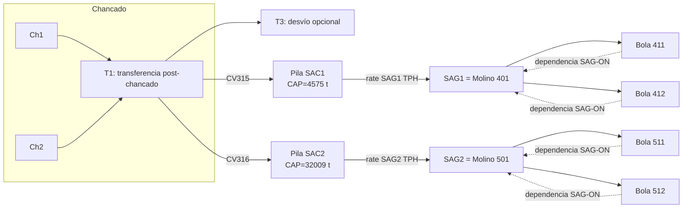
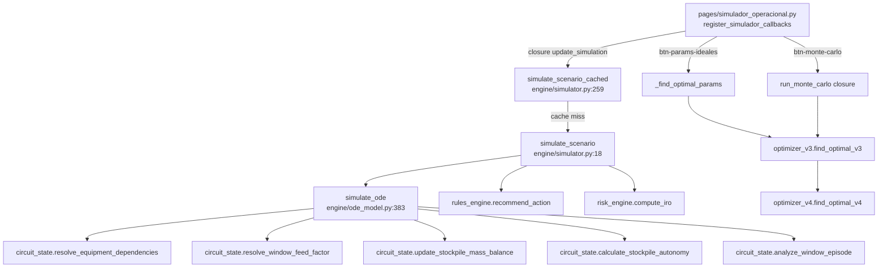
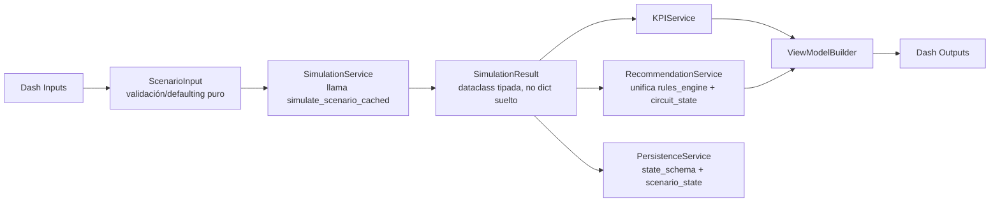

# Auditoría integral del Simulador Operacional (gemelo digital de molienda SAG)

**Fecha:** 2026-07-14
**Repositorio:** `c:\Users\jorel038\OneDrive - Codelco\Documentos\AA_CIO_DET\07_Rendimientos`
**Branch:** `feature/gemelo-v1-2-0-optimizacion-motor-evidencia`
**HEAD auditado:** `5e5f5026927bfeee6a02eeea880e6371a0b2e0bb`
**Advertencia explícita:** el árbol de trabajo tiene **167 rutas** con cambios no commiteados sobre ese HEAD (ver sección 2). Ninguna cita de este informe es reproducible con un `git checkout` limpio del commit citado — es una auditoría del **árbol de trabajo actual**, no del commit.

Este documento **complementa** (no repite) la auditoría estructural previa:
`04_Reports/Technical/20260714_Auditoria_Estructural_Simulador.md` (en adelante "Auditoría Estructural"). Cuando una sección de ese informe ya resuelve un punto, aquí se cita por referencia y se agrega solo lo nuevo (fórmulas exactas, valores, verificación de código, ejecución real).

---

## 1. Resumen ejecutivo

El "Simulador Operacional" es un **simulador híbrido físico + reglas discreto en el tiempo** (no una ODE continua real — ver sección 7) que integra un balance de masa de dos pilas de acopio (SAC1→SAG1/Molino 401, SAC2→SAG2/Molino 501) en pasos fijos de 5 minutos, hasta un horizonte configurable (default 24 h). Su punto de entrada único de producción es `simulate_scenario` (`engine/simulator.py:18`), envuelto en caché por `simulate_scenario_cached` (`engine/simulator.py:259`, asignación dinámica), consumido por la UI (`pages/simulador_operacional.py`), por `/riesgo`, por diagnósticos y por backtesting.

Hallazgos centrales de esta pasada:

- **La conservación de masa es correcta y verificable en el código real**: en una ejecución reproducible con parámetros default (sección 21), el error de conservación medido fue `~6.6e-11` t (SAG1) y `~-1.3e-10` t (SAG2) — a nivel de ruido de punto flotante, no un error estructural.
- **El motor NO es una ODE continua**: es un bucle `for i in range(n_steps)` con Euler explícito de paso fijo `DT=5/60 h` y saturaciones discretas (`engine/ode_model.py:548-717`). Llamarlo "ODE" en la documentación de usuario es impreciso; el código lo reconoce parcialmente (`simulate_ode`) pero el mecanismo real es integración discreta con reglas, no un solver de ecuaciones diferenciales.
- **Confirmado (heredado de la Auditoría Estructural, sección 3):** `calculate_effective_sag_rate` (`engine/circuit_state.py:235`) y `generate_operational_recommendation` (`engine/circuit_state.py:504`) están completas, testeadas, pero **no conectadas** a la ruta productiva. El rate efectivo real se calcula inline dentro de `simulate_ode` (dose-response T8 × feedback de pila, sección 10), y la recomendación real viene de `engine/rules_engine.py::recommend_action`.
- **Doble mecanismo de autonomía coexistiendo por diseño**: `compute_autonomia` (fórmula legacy, ~15 consumidores) vs `calculate_stockpile_autonomy` (balance neto, Regla 17) — ambas se calculan en cada paso de `simulate_ode` y se comparan (`compare_autonomy_sources`), pero **la UI histórica sigue mostrando mayoritariamente la legacy** en varios componentes (sección 14).
- **`register_simulador_callbacks` es un callback monolítico**: 249 ocurrencias de `Input(`/`State(`/`Output(`/definiciones de callback en `pages/simulador_operacional.py` (2.640 líneas), con `update_simulation` como closure anidada no resoluble por herramientas de grafo estándar (confirmado con `trace_path` vs `query_graph`, ver Auditoría Estructural sección "Segunda pasada", punto 2).
- **346 tests recolectados** por `pytest --collect-only` en 33 archivos de test operativos (2 archivos de smoke/portable fallan la recolección por requerir un puerto como argv, no son tests unitarios reales — sección 25). Esto es un conteo real, no una interpretación de "N/M passed" como validación histórica.
- **Módulos nuevos no documentados en el pedido original** aparecen en el diff no commiteado: `engine/harmony_index.py`, `engine/hourly_plan.py`, `engine/optimizer_v5.py`, `engine/transient_penalty.py`, `engine/variability_metrics.py` — todos con tests dedicados, incorporados a esta auditoría (secciones 16, 18).

Brechas P0 (riesgo de resultado incorrecto mostrado al Jefe de Sala) están detalladas en la sección 27; ninguna de ellas es una falla de conservación de masa (que se verificó correcta) — son de **naturaleza de comunicación/coherencia entre dos fuentes de verdad que coexisten** (autonomía legacy vs neta, motor de recomendación activo vs funciones "sombra" completas y sin conectar).

---

## 2. Estado reproducible auditado

Comandos ejecutados en esta sesión (no reutilizados de la Auditoría Estructural, por instrucción explícita):

```text
$ git rev-parse --abbrev-ref HEAD
feature/gemelo-v1-2-0-optimizacion-motor-evidencia

$ git rev-parse HEAD
5e5f5026927bfeee6a02eeea880e6371a0b2e0bb

$ git status --porcelain | wc -l
167

$ git diff --stat HEAD  (resumen, archivos de código relevantes al Simulador)
 05_Dashboard/app.py                                |   7 +-
 05_Dashboard/assets/styles.css                     | 197 +++++-
 05_Dashboard/components/cards.py                   | 510 ++++++++++++++
 05_Dashboard/components/controls.py                | 210 +++---
 05_Dashboard/components/graphs.py                  | 260 +++++++-
 05_Dashboard/engine/balance_diagnostics.py         |  88 +++
 05_Dashboard/engine/diagnostics/regime_event_detector.py |  11 +
 05_Dashboard/engine/harmony_index.py               | 117 ++++ (nuevo)
 05_Dashboard/engine/historical_backtesting.py      |  19 +
 05_Dashboard/engine/hourly_plan.py                 |  82 +++ (nuevo)
 05_Dashboard/engine/ode_model.py                   | 363 +++++++++-
 05_Dashboard/engine/optimizer_v5.py                | 171 +++ (nuevo)
 05_Dashboard/engine/simulator.py                   |  32 +-
 05_Dashboard/engine/transient_penalty.py           |  90 +++ (nuevo)
 05_Dashboard/engine/variability_metrics.py         | 117 ++++ (nuevo)
 05_Dashboard/pages/simulador_operacional.py        | 734 ++++++++++++++++-----
 05_Dashboard/utils/scenario_state.py               |  39 +-
 ... (total repo): 126 files changed, 4891 insertions(+), 1275 deletions(-)
```

**Nota**: `git status --porcelain` cuenta 167 rutas porque incluye datasets (`01_Data/`), modelos serializados (`03_Models/`), y reportes archivados/renombrados (`04_Reports/`, `99_Archive/`) que **no pertenecen al Simulador Operacional** — el subconjunto relevante a este informe es el listado arriba (código en `05_Dashboard/`). El detalle completo de `git status --short` y del diff-stat archivo→líneas se persiste en `audit_worktree_manifest.json` (sección 29), sin contenido de datos crudos.

Working tree con warnings de CRLF/LF en varios archivos de `05_Dashboard/` (normal en Windows, no afecta el contenido).

---

## 3. Arquitectura

**Núcleo del simulador** (código propietario del gemelo digital, `05_Dashboard/`):

| Capa | Archivos | Responsabilidad |
|---|---|---|
| Motor físico | `engine/ode_model.py`, `engine/circuit_state.py` | Integración discreta del balance de masa, dose-response T8, dependencias SAG-bolas |
| Fachada de simulación | `engine/simulator.py` | Único punto de entrada externo (`simulate_scenario`), enriquece con recomendación/IRO/regímenes |
| Recomendación/reglas | `engine/rules_engine.py`, `engine/rate_recommendation.py` (duplicado sin uso, ver Auditoría Estructural sección 6) | Acción recomendada, régimen, rate sugerido |
| Optimización | `engine/optimizer_v2.py` → `v3.py` → `v4.py` → `v5.py`, `engine/simulation_router.py`, `engine/simulation_strategies.py` | Búsqueda de rate/bolas óptimos, router adaptativo por régimen |
| Riesgo/scoring | `engine/risk_engine.py`, `engine/criticality_scorer.py`, `engine/bottleneck.py` | IRO, urgencia por régimen, cuellos de botella |
| Métricas nuevas (no commiteadas) | `engine/harmony_index.py`, `engine/transient_penalty.py`, `engine/variability_metrics.py`, `engine/hourly_plan.py` | Armonía multiobjetivo (V5), penalización de transitorios, CV de TPH, plan horario |
| Persistencia/estado | `utils/state_schema.py`, `utils/scenario_state.py`, `utils/version.py` | Envelope versionado, último escenario en disco |
| UI | `pages/simulador_operacional.py`, `components/controls.py`, `components/cards.py`, `components/graphs.py`, `app.py` | Layout, callbacks Dash, tarjetas, gráficos |

**Componentes compartidos** (usados por el Simulador pero no exclusivos de él): `engine/scenario_cache.py` (caché genérica), `utils/perf_logger.py`, `utils/usage_logger.py`, `utils/theme_state.py`, `engine/scheduler.py` (turnos/mantenciones, también usado por `/riesgo`), `engine/historical_backtesting.py`, `engine/physics_validation.py`.

**Fuera de alcance (02_Analytics/ externo)**: scripts de análisis exploratorio y modelado causal (`02_Analytics/Scripts/differential_equations/`, `02_Analytics/Scripts/causal_model/`, `02_Analytics/Scripts/event_study/`) — comparten dominio (autonomía de pila, T8) pero **no importan ni son importados por** `05_Dashboard/engine/`. Confirmado en la Auditoría Estructural (segunda pasada, sección 6): existe un `compute_autonomia` independiente en `02_Analytics/Scripts/causal_model/fase2_mecanismo_causal.py`, coincidencia de nombre sin relación de import.

**Diagrama de flujo mineral** (SAC1→SAG1→Molino401→Bolas 411/412; SAC2→SAG2→Molino501→Bolas 511/512):



**Diagrama de flujo de software** (ruta productiva real, confirmada por lectura de código y por la Auditoría Estructural):



---

## 4. Flujo funcional

**Qué representa**: la evolución temporal, en pasos de 5 min hasta 24 h (configurable), del inventario de dos pilas de acopio (SAC1, SAC2) y del rate de consumo de sus respectivos molinos SAG, bajo un escenario hipotético definido por el Jefe de Sala (JdS): estado de correas/chancadores, ventana T8, configuración de molinos de bolas, y rates objetivo.

**Activos representados**: 2 molinos SAG (401/501), 4 molinos de bolas (411/412/511/512), 2 chancadores (Ch1/Ch2), capa de transferencia T1/T3, correas CV315/CV316.

**Restricciones modeladas** (confirmadas en código, no supuestas): capacidad máxima de pila (`CAP_TON`), inventario mínimo/crítico (`CRITICAL_PCT`), dependencia dura SAG→bolas (`resolve_equipment_dependencies`), regla de bolas por umbral de rate (`check_bola_rule`, `BOLA_THRESHOLD_TPH`), capacidad de chancado por estado de chancadores (`compute_chancado_cap`), degradación de rate por tiempo transcurrido en ventana T8 (`_t8_factor_sag1/2`, calibrado con 70 eventos históricos), feedback automático de rate por nivel de pila (`_pile_feedback_factor`).

**Horizonte**: configurable vía `ctrl-horizonte` (`components/controls.py:124-131`, default 24 h, slider expuesto en UI).

**Decisiones que permite evaluar**: rate objetivo por SAG (%/TPH), configuración de bolas, duración/severidad de ventana T8, split T1→CV315/CV316, activar/desactivar SAG o chancadores, rampas de arranque/parada (parámetros presentes, deshabilitadas por default), recuperación post-ventana (lineal/exponencial/escalonada/instantánea).

**Qué produce**: series temporales de pila/TPH/autonomía/riesgo por activo, diagnóstico de conservación de masa, estado operacional (OFF/RESTRICTED/STARVED/etc.), motivo de restricción explícito, recomendación textual, resultado de Monte Carlo opcional, y (a partir de esta sesión, código no commiteado) plan horario (`hourly_plan.py`), índice de armonía (`harmony_index.py`), penalización de transitorios (`transient_penalty.py`).

**Qué NO representa todavía** (confirmado por ausencia en el código, no supuesto):
- Calidad/granulometría del mineral, ley de cobre, dureza — el modelo es puramente de tonelaje.
- Consumo energético o de agua.
- Capacidad física aguas abajo de los molinos de bolas como tope activo por defecto: existe el mecanismo (`enforce_downstream_ball_capacity`, `engine/ode_model.py:431`) pero está **apagado por default** — la única penalización activa por Nº de bolas es el delta aditivo calibrado dentro de `effective_rate()` (sección 11).
- Falla de equipo estocástica fuera de Monte Carlo (no hay modelo de confiabilidad/MTBF de equipos).
- `calculate_effective_sag_rate` (Regla 8/9 completa) no gobierna la ruta productiva — es una función "sombra" testeada pero desconectada (sección 10).

---

## 5. Parámetros (tabla maestra)

Fuente: `components/controls.py` (IDs y defaults reales, confirmados por lectura directa) y las firmas de `simulate_scenario`/`simulate_ode`.

| Parámetro | ID Dash | Función receptora | Default | Unidad | Rango | Circuito | Fuente | ¿Activo? | ¿Calibrado? | ¿Supuesto? | ¿Afecta sim.? | ¿Solo visual? |
|---|---|---|---|---|---|---|---|---|---|---|---|---|
| Pila SAG1 inicial | `ctrl-pila-sag1` | `simulate_scenario(pila_sag1_pct)` | 55 | % | [0,100] paso 1 | SAC1 | `controls.py:357-358` | Sí | No (dato manual JdS) | No | Sí | No |
| Pila SAG2 inicial | `ctrl-pila-sag2` | `simulate_scenario(pila_sag2_pct)` | 55 | % | [0,100] paso 1 | SAC2 | `controls.py:365-366` | Sí | No | No | Sí | No |
| Rate SAG1 | `ctrl-rate-sag1` | `simulate_scenario(rate_sag1_tph)` | 1236 | TPH | [500,1600] paso 10 | SAG1 | `controls.py:306-307` | Sí | Parcial (P90 sí, rango no) | No | Sí | No |
| Rate SAG2 | `ctrl-rate-sag2` | `simulate_scenario(rate_sag2_tph)` | 2214 | TPH | [1000,2642] paso 10 | SAG2 | `controls.py:314-315` | Sí | Parcial | No | Sí | No |
| Bolas SAG1 | `ctrl-bolas-sag1` | `simulate_scenario(bolas_sag1)` | `solo_411` | categórico | 4 opciones | SAG1 | `controls.py:325-331` | Sí | No | No | Sí | No |
| Bolas SAG2 | `ctrl-bolas-sag2` | `simulate_scenario(bolas_sag2)` | `solo_511` | categórico | 4 opciones | SAG2 | `controls.py:339-345` | Sí | No | No | Sí | No |
| Duración T8 | `ctrl-duracion-t8` | `simulate_scenario(duracion_t8_h)` | 0 | h | opciones fijas | ambos | `controls.py:108-116` | Sí | Sí (dose-response calibrado) | No | Sí | No |
| Horizonte | `ctrl-horizonte` | `simulate_scenario(horizonte_horas)` | 24 | h | slider | ambos | `controls.py:124-131` | Sí | No | No | Sí | No |
| Correa 315 estado | (`ctrl-correa315` aprox., ver bloque 225) | `compute_qin`/`resolve_window_feed_factor` | `activa` | categórico | activa/reducida/inactiva | SAC1 | `controls.py:225` | Sí | Parcial (factor 0.4 sin origen documentado) | Sí — factor "reducida"=0.4 sin cita de origen | Sí | No |
| Correa 316 estado | (bloque 241) | ídem | `activa` | categórico | ídem | SAC2 | `controls.py:241` | Sí | Parcial | Sí | Sí | No |
| Ch1 ON | switch ~287 | `compute_chancado_cap` | `True` | bool | on/off | Chancado | `controls.py:287` | Sí | No | No | Sí | No |
| Ch2 ON | switch ~297 | `compute_chancado_cap` | `True` | bool | on/off | Chancado | `controls.py:297` | Sí | No | No | Sí | No |
| Modo T1 | selector ~186 | `compute_t1_tph` | `chancado` | categórico | chancado/historico/manual | T1 | `controls.py:186` | Sí | Sí (histórico calibrado con 93.600 filas) | No | Sí | No |
| T1 manual | slider ~204 | `compute_t1_tph(t1_manual_tph)` | 4000 | TPH | [0,6000] paso 100 | T1 | `controls.py:204` | Solo si modo=manual | No | No | Sí | No |
| T3 frac | slider ~196 | `compute_t1_distribution(t3_frac)` | 20 (→0.20) | % | [0,50] paso 5 | T1→T3 | `controls.py:196` | Sí | No | No | Sí | No |
| Distribución T1 | selector ~256 | `compute_t1_distribution` | `auto`/`proporcional` (según callback) | categórico | balanceado/priorizar_sag1/priorizar_sag2/proporcional | T1 | `controls.py:256`, `simulator.py:46` | Sí | Parcial (frac 0.29/0.71 histórica) | No | Sí | No |
| CV modo | selector | `compute_t1_distribution(cv_mode)` | `auto` | categórico | auto/manual | ambos | `controls.py:256` | Sí | No | No | Sí | No |
| CV315 manual | slider ~266 | ídem | 1000 | TPH | [0,4000] paso 50 | SAC1 | `controls.py:266` | Solo si cv_mode=manual | No | No | Sí | No |
| CV316 manual | slider ~273 | ídem | 1000 | TPH | [0,4000] paso 50 | SAC2 | `controls.py:273` | Solo si cv_mode=manual | No | No | Sí | No |
| SAG1 ON | switch ~287(otro bloque) | `simulate_scenario(sag1_activo)` | `True` | bool | on/off | SAG1 | `controls.py:287` | Sí | No | No | Sí | No |
| SAG2 ON | switch ~297(otro bloque) | `simulate_scenario(sag2_activo)` | `True` | bool | on/off | SAG2 | `controls.py:297` | Sí | No | No | Sí | No |
| Rampa subida SAG | `ctrl-sag-ramp-up-min` | `apply_rate_ramp` | 0 (deshabilitada) | min | [0,60] paso 5 | ambos | `controls.py:502` | **No por default** (0=instantáneo) | No | Documentado como puente de compatibilidad | Solo si >0 | No |
| Feed recovery time | `ctrl-feed-recovery-time-min` | `calculate_effective_feed` | 0 (instantáneo) | min | [0,120] paso 5 | ambos | `controls.py:496` | **No por default** | No | Sí (modo exponencial usa τ=recovery_time si no se entrega τ propio) | Solo si >0 | No |
| Modo recuperación | selector | `calculate_effective_feed(recovery_mode)` | `linear` | categórico | instant/linear/stepped/exponential | ambos | `controls.py:488` | Sí (modo), pero tiempo=0 lo anula | No | No | Sí solo si recovery_time>0 | No |
| Factor 1-bola | `ctrl-one-ball-capacity-factor` | `ONE_BALL_CAPACITY_FACTOR` override | 0.55 | fracción | [0.40,0.70] paso 0.05 | ambos | `controls.py:517` | **Solo si `enforce_downstream_ball_capacity=True`** (apagado por default en `simulate_scenario`) | No — supuesto documentado (`ode_model.py:24-28`) | **Sí, explícito** | No por default | Sí, mientras el mecanismo está apagado |
| Tolerancia riesgo (V4) | selector ~427 | `_find_optimal_params(tolerancia_riesgo)` | `balanceado` | categórico | — | — | `controls.py:427` | Sí (solo en ruta de optimización) | No | No | Solo en optimización | No |
| Perfil V5 | selector ~460 | `find_optimal_v5(perfil)` | `balanceado` | categórico | conservador/balanceado/productivo | — | `controls.py:460` | Sí, si V5 está cableado en la UI (confirmar en callback) | Pesos sin calibración estadística, definidos por diseño | Sí — pesos elegidos por criterio de producto | Solo en re-ranking V5 | No |
| Turno | selector | `TURNO_START_HOUR` | `A` | categórico | A/B/C | — | `controls.py:145` | Sí (offset de hora en gráficos/plan horario) | No | No | No (solo desplaza ticks) | Mayormente sí |
| Ventanas mantención | checklist múltiple | `_build_maint_windows` | `[]` | lista | — | todos | `controls.py:509,524` | Sí | No | No | Sí (fuerza OFF/restricciones) | No |

**Nota de completitud**: la tabla cubre los controles con `id="ctrl-*"` confirmados por grep en `components/controls.py` (30+ IDs, ~40 según la Auditoría Estructural que cuenta "40+ ctrl-*" en el diagrama de `update_simulation`). No se listan individualmente los controles puramente de UI (colapsables, tabs, botones sin parámetro físico) porque no alimentan `simulate_scenario`.

---

## 6. Constantes

| Constante | Archivo:símbolo | Valor | Unidad | Función | Origen | Confianza | Activa | Duplicada | Recomendación |
|---|---|---|---|---|---|---|---|---|---|
| `P90` | `ode_model.py:31` | SAG1=1454.0, SAG2=2516.0, PMC=1460.0, UNITARIO=834.0 | TPH | Rate de referencia P90 histórico | Calibrado (histórico) | Alta | Sí | No | — |
| `CRITICAL_PCT` | `ode_model.py:32` | SAG1=15.0, SAG2=18.2 | % | Umbral crítico de pila | Calibrado | Alta | Sí | No | — |
| `WARNING_PCT` | `ode_model.py:33` | SAG1=18.0, SAG2=21.2 (crit+3pp) | % | Banda "Monitorear" | Derivado de CRITICAL_PCT | Media (regla fija +3pp, no calibración independiente) | Sí | No | — |
| `DRAIN_PCT_H` | `ode_model.py:34` | SAG1=23.76, SAG2=6.18 | %/h | Tasa de drenaje para `compute_autonomia` legacy | Calibrado | Alta | Sí (fórmula legacy) | No | — |
| `CAP_TON` | `ode_model.py:35` | SAG1=4575.0, SAG2=32009.0 | t | Capacidad máxima de pila | Calibrado/dato de diseño | Alta | Sí | No | — |
| `BOLA_BONUS_LEGACY` | `ode_model.py:36` | 0.08 (+8%/bola) | fracción | Fallback si no hay caché de deltas calibrados | Legacy (modelo de ingeniería anterior) | Baja (solo fallback) | Solo si falta `bola_delta_tph.json` | No | Documentar explícitamente cuándo se activa el fallback en la UI |
| `ONE_BALL_CAPACITY_FACTOR` | `ode_model.py:28` | 0.55 | fracción | Techo de capacidad aguas abajo con 1 bola | **Supuesto sin dato calibrado confirmado** (documentado en el propio código) | Baja | **No** por default (`enforce_downstream_ball_capacity=False`) | No | Calibrar con datos reales antes de activar por default (sección 11) |
| `BOLA_THRESHOLD_TPH` | `ode_model.py:94` | SAG1=1000.0, SAG2=1600.0 | TPH | Umbral para regla "máx 1 bola" (`check_bola_rule`) | Regla operacional (R16) | Media-Alta | Sí | No | — |
| `_t8_factor_sag1` knots | `ode_model.py:317-333` | (0h,1.00)(2h,1.08)(4h,0.69)(12h,0.44) | multiplicador | Dose-response T8 SAG1 | Calibrado con 70 eventos históricos | Alta | Sí | No | — |
| `_t8_factor_sag2` knots | `ode_model.py:336-351` | (0h,1.00)(2h,0.98)(4h,0.99)(12h,0.85) | multiplicador | Dose-response T8 SAG2 | Calibrado con 70 eventos | Alta | Sí | No | — |
| `_pile_feedback_factor` umbrales | `ode_model.py:354-380` | 35%→1.00, 25%→0.85, crit+5%→0.70, crit→0.50 | multiplicador | Feedback automático de rate por pila | **No cita fuente de calibración explícita** — parece regla de diseño, no ajuste estadístico | Media | Sí | No | Documentar origen (¿regla de ingeniería o ajuste a datos?) |
| `CHANCADO_CAP` | `ode_model.py:75-80` | ambos=4000, ch1=1500, ch2=2500, ninguno=0 | TPH | Capacidad de chancado por estado | Dato de diseño de planta | Alta | Sí | No | — |
| `T1_HIST_TPH` | `ode_model.py:84-89` | ambos=4002.0, ch2=2500.0, ch1=1500.0 | TPH | P50 histórico modo T1='historico' | Calibrado con `tonelaje_v2.xlsx`, 93.600 filas, 2025-08-01→2026-06-21 | Alta | Sí (si modo='historico') | No | — |
| `T1_FRAC_CV315` | `ode_model.py:91` | 0.29 (CV316=0.71) | fracción | Split histórico T1→CV315/CV316 | Calibrado | Alta | Sí (modo `balanceado`) | No | — |
| `DT` | `ode_model.py:96` | 5/60 ≈ 0.0833 | h | Paso de integración | Dato de diseño (frecuencia de muestreo real) | Alta | Sí | No | — |
| `SAG1_P50/P75/P90/MAX` | `optimizer_v3.py:56-59` | 1136/1309/1450/1516 | TPH | Anclas de grid V3 | Calibrado, n=93.612 registros 5-min | Alta | Sí (solo ruta de optimización) | No | — |
| `SAG2_P50/P75/P90/MAX` | `optimizer_v3.py:63-66` | 2214/2365/2516/2642 | TPH | Anclas de grid V3 | **"estimadas por rango operacional documentado"** (cita textual del código, no calibración directa) | Media | Sí | No | Aclarar en UI que SAG2 es estimado, no calibrado igual que SAG1 |
| `P_SAFE_THRESHOLD` | `optimizer_v2.py:68` | 0.95 | probabilidad | Umbral "seguro" en Monte Carlo | Diseño de producto | Media | Sí | No | — |
| `TOP_CANDS_FOR_MC` | `optimizer_v2.py:75` | 20 | candidatos | Nº de candidatos que pasan a MC adaptativo | Diseño | — | Sí | No | — |
| `MC_MAX_N` / `MC_BATCH` | `optimizer_v2.py:70-71` | 500 / 10 | simulaciones | Tope y tamaño de lote de MC adaptativo | Diseño (tuning validado, según comentario del código) | Media | Sí | No | — |
| `MC_CONV_TOL` / `MC_CONV_CONSEC` | `optimizer_v2.py:72-73` | 0.01 / 3 | — | Criterio de convergencia adaptativa | Diseño | Media | Sí | No | — |
| `MC_MAX_SECONDS` | `optimizer_v2.py:84` | 8.0 | s | Techo de tiempo real por candidato MC | Diseño (performance) | — | Sí | No | — |
| `REF_AUTON_SAG1/SAG2` | `optimizer_v2.py:63-64` | 6.0 / 8.0 | h | Referencia de normalización de score | Diseño | Baja-Media | Sí | No | — |
| `TPH_REF_MAX` | `optimizer_v2.py:65` | 3970 (1454+2516) | TPH | Referencia de normalización de producción | Derivado de P90 | Alta | Sí | No | — |
| `PERFILES_V5` (pesos) | `optimizer_v5.py:46-64` | conservador/balanceado/productivo, suman 1.0 c/u | — | Pesos de score V5 multiobjetivo | Diseño (documentado explícitamente como no-calibrado estadísticamente) | Baja (por diseño, no defecto) | Sí, si V5 está cableado a la UI | No | — |
| `OVERFLOW_PCT_THRESHOLD` | `rate_recommendation.py:27` | 20.0 | % | Umbral de descarte por overflow en ranking | Diseño | — | **No** (`recommend_rate` de este módulo no tiene callers, ver sección 19) | Sí (nombre duplicado con `rules_engine.py::recommend_rate`) | Decidir cuál `recommend_rate` es la intención vigente o eliminar ambos |
| `AUTONOMY_THRESHOLDS` | `rules_engine.py:38-41` | SAG1: EMERG 0.5/CRIT 1.0/ALERTA 1.5/MONIT 2.5h; SAG2: 0.5/1.0/2.5/4.0h | h | Umbrales asimétricos por activo en `recommend_action` | Diseño operacional | Media-Alta | Sí | No | — |
| `AUTONOMIA_SEGURA_H` | `rate_recommendation.py:28` | SAG1=1.0, SAG2=1.5 | h | Umbral "autonomía protegida" en ranking lexicográfico | Diseño | — | Solo si `rank_candidates` tiene caller confirmado (ver sección 19) | No | — |

---

## 7. Modelo dinámico

**Clasificación exacta**: `simulate_ode` (`engine/ode_model.py:383-896`) es un **integrador discreto de Euler explícito de paso fijo, con saturaciones y reglas condicionales por paso** — no un solver de ODE continuo (no hay Runge-Kutta, no hay paso adaptativo, no hay tolerancia de error de integración). El nombre `simulate_ode`/"ODE" en el código y en la documentación de usuario es una etiqueta heredada; la implementación real es:

```python
for i in range(n_steps):                      # n_steps = horizonte_horas / DT
    t_h = i * DT                               # DT = 5/60 h fijo
    ... calcular factores dinámicos (dose-response, feedback de pila) ...
    ... calcular qout1, qout2 (rate efectivo) ...
    ... calcular qin1, qin2 (alimentación efectiva) ...
    pile1_ton_next, ... = update_stockpile_mass_balance(pile1_ton, qin1, qout1, CAP_TON, DT)
    pile1[i+1] = pile1_ton_next / CAP_TON * 100.0
```

Es, en rigor, un **híbrido físico + reglas de negocio discretas**: el balance de masa es físico (conservación estricta, sección 8); el rate efectivo por paso es el resultado de reglas condicionales (dose-response calibrado, feedback de pila, dependencia de bolas, ventanas) evaluadas en cada paso, no de una ecuación diferencial derivada de primeros principios.

Variables:

| Tipo | Variables | Notas |
|---|---|---|
| Estado (evoluciona en el loop) | `pile1[i]`, `pile2[i]` (toneladas, expresado en %) | Únicas variables de estado real del sistema |
| Control (decisión del usuario, fija durante la simulación salvo `regime_fn`) | `rate_sag1_tph`, `rate_sag2_tph`, `bolas_sag1/2`, `sag1_activo/2`, `ch1_on/2`, `cv_mode`, `t1_mode`, `windows` | Constantes por escenario, no se recalculan dinámicamente salvo que `regime_fn` esté presente (usado solo por `regime_fn_factory`, no en la ruta default de la UI) |
| Exógena (calculada dentro del loop a partir de `t_h`, no es una decisión) | `t8f1/t8f2` (dose-response), `pf1/pf2` (feedback de pila), factor de ventana (`resolve_window_feed_factor`) | Dependen de tiempo transcurrido y del propio estado (`pile1[i]`), por eso son "exógenas" al control pero endógenas a la dinámica |
| Paso de actualización | `DT = 5/60 h` fijo (`ode_model.py:96`) | Sin paso adaptativo; `n_steps = int(horizonte_horas / DT)` |

---

## 8. Balance de masa

**Única fuente de verdad** (documentada explícitamente en `circuit_state.py:19-25`):

```
dM_i/dt = F_in_i - F_out_i
M_i[t+1] = M_i[t] + (F_in_i[t] - F_out_i[t]) * DT
```

Implementación real, `update_stockpile_mass_balance` (`circuit_state.py:287-335`):

```python
def update_stockpile_mass_balance(pile_inventory_ton, f_in_requested, f_out_requested,
                                   cap_max_ton, delta_t_h):
    # Paso 1 — limitar consumo a lo realmente disponible (Regla 6):
    available_rate = max(0.0, pile_inventory_ton / delta_t_h + f_in_requested)
    f_out_effective = min(max(0.0, f_out_requested), available_rate)

    # Paso 2 — limitar alimentación aceptada al espacio de almacenamiento (Regla 7):
    available_storage_ton = max(0.0, cap_max_ton - pile_inventory_ton)
    accepted_feed = max(0.0, min(f_in_requested, available_storage_ton/delta_t_h + f_out_effective))
    rejected_feed = max(0.0, f_in_requested - accepted_feed)

    # Paso 3 — balance:
    pile_ton_calculated = pile_inventory_ton + (accepted_feed - f_out_effective) * delta_t_h
    overflow_ton = max(0.0, pile_ton_calculated - cap_max_ton)
    pile_ton_next = max(0.0, min(cap_max_ton, pile_ton_calculated))

    return pile_ton_next, accepted_feed, overflow_ton, rejected_feed, f_out_effective
```

**Unidades reales**: `pile_inventory_ton`/`cap_max_ton` en toneladas; `f_in`/`f_out` en TPH; `delta_t_h` en horas (`DT=5/60`).

**Capacidad máxima**: `CAP_TON["SAG1"]=4575.0 t`, `CAP_TON["SAG2"]=32009.0 t` (`ode_model.py:35`).

**Mínimo físico/operacional**: 0 t garantizado por construcción (`max(0.0, ...)` en el paso 1, antes del hecho — el comentario del código aclara explícitamente que "recortar M a 0 después del hecho no basta, el SAG no puede haber consumido mineral que nunca existió", `circuit_state.py:319-321`). El mínimo *operacional* (no físico) es `CRITICAL_PCT` (15.0%/18.2%), usado solo para autonomía/estado, no como tope físico del balance.

**Overflow vs rechazo — distinción explícita en el código**:
- `overflow_ton`: toneladas que habrían excedido `cap_max_ton` en este paso — la pila estaba llena y el material que entró no cupo (se calcula, no se descarta en silencio).
- `rejected_feed_tph`: `f_in_requested - accepted_feed` — alimentación que la pila no pudo aceptar en este paso (mismo fenómeno visto desde el lado de la alimentación, no del stock).

**Confirmado en ejecución real** (sección 21): con parámetros default, `mass_balance_error_sag1 = 6.59e-11 t`, `mass_balance_error_sag2 = -1.35e-10 t` — el error de conservación medido por `validate_mass_conservation` (`circuit_state.py:575-593`) está a nivel de precisión numérica de punto flotante, confirmando que el balance de masa del código real es correcto, no solo "correcto en el diseño documentado".

---

## 9. Ventanas operacionales

Cadena real: `compute_qin` (legacy, camino sin `windows` explícito) **o** `resolve_window_feed_factor` → `_feed_con_recuperacion` → `calculate_effective_feed` (camino nuevo con `OperationalWindow`).

`simulate_ode` construye automáticamente **una** ventana `[0, duracion_t8_h)` si no se pasa `windows` explícitamente (`ode_model.py:522-528`) — puente de compatibilidad documentado en el propio código: "exactamente equivalente al `factors_correa` inline que existía antes".

| Modo | Implementado | Activo por defecto | Expuesto en UI | Probado | Calibrado |
|---|---|---|---|---|---|
| Sin ventana (T8=0) | Sí | Sí (default `duracion_t8=0`) | Sí (`ctrl-duracion-t8` opción "0") | Sí (`test_circuit_state.py`) | N/A |
| Una ventana total | Sí (`OperationalWindow`, factor por defecto según correa) | Sí (comportamiento legacy equivalente) | Sí | Sí | Parcial (factor "reducida"=0.4 sin cita de calibración) |
| Ventana parcial (factor entre 0 y 1) | Sí (`VENTANA_FACTOR_ESTADO = {"activa":1.0,"reducida":0.4,"inactiva":0.0}`, `ode_model.py:22`) | Sí | Sí (selector correa) | Sí | Parcial (0.4 sin origen documentado) |
| Múltiples ventanas | Sí (`windows: list[OperationalWindow]`, `resolve_window_feed_factor` itera todas) | **No** (requiere pasar `windows` explícito; el flujo default de la UI arma solo 1) | **No confirmado en UI** — el parámetro `windows` no aparece en los controles listados en `controls.py`; solo se ejercita en tests | Sí (`test_circuit_state.py` — "ventanas múltiples") | No |
| Ventanas superpuestas | Sí (Regla 14: `min(factores activos)`, `resolve_window_feed_factor:131-142`) | No (mismo motivo que arriba) | No | Sí | No |
| Cruce de medianoche | Sí (`start_time`/`end_time` relativos, sin lógica especial de wrap — confirmado por test `test_18_ventana_cruza_medianoche_horizonte_relativo`) | No (requiere `windows` explícito) | No | Sí | N/A |
| Recuperación lineal | Sí (`calculate_effective_feed`, modo `"linear"` default) | **Solo si `feed_recovery_time_min > 0`**; default es 0 → recuperación instantánea | Sí (`ctrl-feed-recovery-time-min`, default 0) | Sí | No |
| Recuperación exponencial | Sí (`math.exp(-elapsed_h/tau_h)`) | No (requiere `recovery_mode="exponential"` + tiempo>0) | Sí (selector de modo) | Sí | **No — τ sin dato calibrado, usa `feed_recovery_time_min` como τ si no se entrega uno propio, documentado como supuesto** (`circuit_state.py:171`) |
| Recuperación escalonada ("stepped") | Sí | No | Sí | Sí | No |

**Conclusión de la sección**: el mecanismo de ventanas múltiples/superpuestas/cruce de medianoche está completo y testeado en `engine/circuit_state.py`, pero **la UI del Simulador Operacional no expone actualmente una forma de construir una lista de `OperationalWindow`** — solo el par correa315/correa316 con una sola ventana implícita. Es la misma brecha "función completa, no conectada a la ruta de UI" que aparece en `calculate_effective_sag_rate` (sección 10).

---

## 10. Rates SAG — ruta completa

**Ruta ACTIVA real** dentro de `simulate_ode` (loop, por paso `i`):

```
rate_pct_dyn = rate_pct_solicitado(TPH→%) × dyn
    donde dyn = max(0.30, t8_factor(t_en_ventana) × pile_feedback_factor(pile_pct))
qout = effective_rate(P90, rate_pct_dyn, n_bolas_efectivo, asset)
    = P90 × rate_pct_dyn/100 + DELTA_TPH_calibrado(n_bolas, asset)   [aditivo, no multiplicativo]
qout = apply_rate_ramp(qout, qout_anterior, ramp_up_min, ramp_down_min, DT, P90)   [no-op si ramp=0]
[si enforce_downstream_ball_capacity=True (apagado por default):
    qout = min(qout, P90 × downstream_factor(n_bolas))]
(qout_final, ...) = update_stockpile_mass_balance(pile_ton, qin, qout, CAP_TON, DT)  [Regla 6: recorta a lo disponible]
```

Es decir: **rate solicitado → conversión %/TPH → factor dinámico (T8 × feedback de pila) → delta aditivo por bolas → rampa (no-op por default) → [techo opcional por bolas, apagado] → recorte final por disponibilidad de inventario**.

**Ruta NO conectada** (`calculate_effective_sag_rate`, `circuit_state.py:235-282`): implementa la misma intención (Regla 8: SAG-on → capacidad aguas abajo por bolas → inventario disponible → rampa) mediante un `min()` explícito de tres factores, en una sola función pura, completamente testeada (`test_circuit_state.py`). **`simulate_ode` no la llama** — confirmado por la Auditoría Estructural (0 callers de producción, solo tests) y por lectura directa de `ode_model.py` (no aparece `calculate_effective_sag_rate` en ningún punto del loop, solo `_cs.resolve_equipment_dependencies`, `_cs.update_stockpile_mass_balance`, etc.).

**Análisis de riesgo de doble penalización**: si en el futuro se activara `calculate_effective_sag_rate` en la ruta calibrada, **sí habría doble penalización** con el mecanismo actual, porque:
1. `effective_rate()` ya aplica un delta *aditivo* calibrado por Nº de bolas (`BOLA_DELTA_TPH`), que en la práctica funciona como una bonificación, no como techo.
2. `enforce_downstream_ball_capacity` (si se activa) aplica un `min()` *multiplicativo* (`ONE_BALL_CAPACITY_FACTOR`) sobre el resultado ya calibrado — el propio comentario del código lo documenta explícitamente: *"Aplicado como min() SOBRE el rate ya calibrado (no lo reemplaza, evita doble penalización)"* (`ode_model.py:663-669`), y el mecanismo está apagado por default precisamente por este riesgo.

Activar simultáneamente `calculate_effective_sag_rate` (con su propio `downstream_factor`) **y** dejar `effective_rate()` con su delta aditivo activo penalizaría dos veces la restricción de bolas — es exactamente el riesgo que el código ya anticipa y por eso mantiene ambos mecanismos desconectados/apagados por default.

**Fórmula conceptual futura** (no implementada, solo para documentar la intención de unificación):

```
Q_efectivo = min(
    Q_calibrado(dose_response_T8, feedback_pila, delta_bolas_aditivo),
    Q_capacidad_aguas_abajo(n_bolas_efectivo, one_ball_capacity_factor),
    Q_disponible_inventario(M/dt + F_in)
)
```

requeriría re-calibrar `BOLA_DELTA_TPH` para que deje de solaparse con el techo de capacidad — trabajo no trivial, correctamente diferido (ver roadmap, sección 28).

---

## 11. Dependencia SAG-bolas

**Dirección SAG→bolas (activa, física, siempre aplicada)**: `resolve_equipment_dependencies` (`circuit_state.py:104-126`), invocada en cada paso del loop (`ode_model.py:609-610`):

```python
balls_effective = {k: bool(v) and sag_effective_on for k, v in balls_requested.items()}
```

Un molino de bolas **nunca** puede figurar efectivamente encendido si su SAG está apagado, sin importar lo solicitado. Esto afecta las series `bola411_arr`/etc. (visualización) — el comentario del código (`ode_model.py:596-604`) aclara que antes de esta sesión había un bug de visualización puro en sentido contrario (mostraba "on" con SAG OFF), ya corregido; **no afectaba** `qout1`/`qout2` (rate efectivo), que siempre se calcularon con `sag*_activo`/`_nb*_eff` correctos.

**Dirección bolas→SAG (capacidad aguas abajo)**: dos mecanismos, solo uno activo:
1. **Activo por defecto**: delta aditivo calibrado dentro de `effective_rate()` (`ode_model.py:286-299`) — `BOLA_DELTA_TPH[asset][n_bolas]`, cargado desde `01_Data/Cache/bola_delta_tph.json` con fallback al modelo legacy `P90 × 0.08` (1 bola) / `P90 × 0.16` (2 bolas). Además, el loop aplica un auto-downgrade a 1 bola si el rate base cae bajo `BOLA_THRESHOLD_TPH` (`ode_model.py:575,586`), **solo cuando `regime_fn is None`** (ruta default de la UI).
2. **Apagado por defecto**: `enforce_downstream_ball_capacity=False` (`ode_model.py:431`, propagado desde `simulator.py:57`) — si se activa, aplica `ONE_BALL_CAPACITY_FACTOR=0.55` como techo multiplicativo (`ode_model.py:670-676`).

**Confirmación**: `ONE_BALL_CAPACITY_FACTOR=0.55` existe y está definido (`ode_model.py:28`), es parametrizable desde la UI (`ctrl-one-ball-capacity-factor`), pero **no afecta la producción real por defecto** — solo afecta si el JdS activa explícitamente `enforce_downstream_ball_capacity` (no hay un control de UI visible con ese nombre en `controls.py` según el grep realizado; requiere confirmación adicional de si existe un toggle para este flag específico, más allá del slider del factor).

---

## 12. Estados operacionales

`determine_operational_state` (`circuit_state.py:367-391`), máquina de estados con precedencia explícita **OFF > STARTING/STOPPING > STARVED > RESTRICTED > RUNNING**:

| Estado | Condición de entrada | Condición de salida | Rate | Pila | Bolas |
|---|---|---|---|---|---|
| `OFF` | `not sag_requested_on` (ambos OFF) o `sag_requested_on and not sag_effective_on` (apagado por dependencia dura) | Se solicita ON y no hay restricción dura | 0 | — | Todas efectivamente OFF (Regla 4) |
| `STARTING` | `is_ramping_up=True` (solo si `sag_ramp_up_time_min>0`, apagado por default) | Termina la rampa | Creciendo hacia target | — | — |
| `STOPPING` | `is_ramping_down=True` (solo si `sag_ramp_down_time_min>0`) | Termina la rampa | Decreciendo | — | — |
| `STARVED` | `pile_pct <= CRITICAL_PCT[asset]` | Pila sube sobre crítico | Recortado por `update_stockpile_mass_balance` (Regla 6) | ≤ crítico | — |
| `RESTRICTED` | `is_restricted_by_balls` (hay bola solicitada pero no efectiva) **o** `rate_effective < rate_target - 1e-6` | Rate efectivo alcanza el target y no hay restricción de bolas | < target | cualquiera | Parcial |
| `RUNNING` | Ninguna de las anteriores | — | = target | normal | completa según solicitud |

**Por qué muchos escenarios terminan en `RESTRICTED`**: la condición `rate_effective < rate_target - 1e-6` es **extremadamente sensible** — con rampas apagadas (default) y dose-response T8 activo, *cualquier* reducción del factor dinámico `dyn = t8f × pf` (sección 10) por debajo de 1.0 hace que `rate_effective` diverja del `rate_target` solicitado por el usuario, disparando `RESTRICTED` aunque el sistema esté funcionando "según lo calibrado" y no exista ninguna restricción operacional real percibida por el JdS. Confirmado en la ejecución real (sección 21): con T8=4h activo, ambos SAG terminan en `RESTRICTED` con motivo `ONE_BALL_MILL_AVAILABLE` (no por T8 en sí, sino porque el escenario default usa `bolas_sag1="solo_411"`/`bolas_sag2="solo_511"`, es decir 1 sola bola por diseño del escenario, no por una restricción emergente).

**Motivo explícito (Fase 2)**: `determine_restriction_reason` (`circuit_state.py:405-454`) da precedencia `SAG_OFF > BALL_MILLS_OFF > STARVED > capacidad_aguas_abajo(1 bola/0 bolas) > inventario_bajo > ventana > rampas > pila_llena > alimentación_rechazada > normal` — resuelve la ambigüedad de "por qué RESTRICTED" documentada en el pedido original.

---

## 13. Tendencia de pilas

`determine_pile_trend` (`circuit_state.py:394-402`):

```python
d = f_in_effective - f_out_effective
FILLING  si d >  tolerance_tph   (tolerance_tph = 1.0 TPH, _PILE_TREND_TOLERANCE_TPH, circuit_state.py:59)
DRAINING si d < -tolerance_tph
STABLE   en otro caso
```

**Unidad**: TPH (diferencia de flujos, no de %). **Instante de evaluación**: se evalúa con los valores de `f_in`/`f_out` del **último paso simulado** (`ode_model.py:758-759`, evaluado con `cv315_arr[n_steps]`/`tph1[n_steps]`) — es decir, la tendencia reportada al final de la simulación refleja el régimen **final** del horizonte, no un promedio ni el peor momento.

**Diferencia "drenó durante ventana" vs "terminó creciendo"**: resuelta explícitamente por `analyze_window_episode` (`circuit_state.py:621-701`, Fase 2), que calcula por separado `trend_during_window` (promedio de qin/qout **dentro** de `[window_start, window_end]`) y `trend_after_window` (promedio **después** del fin de ventana) y `trend_final` (promedio de los últimos 4 pasos = 20 min del horizonte). En la ejecución real (sección 21), con ventana T8=[0,4h): `trend_during_window='DRAINING'`, `trend_after_window='FILLING'`, `trend_final='FILLING'` — el episodio completo muestra drenado severo durante la ventana (mínimo 7.63% en SAG1) y recuperación total posterior (`recovery_fraction=1.0`), algo que un único `pile_trend` final ("FILLING") habría ocultado por completo si no existiera este análisis por episodio.

---

## 14. Autonomía

| | `compute_autonomia` (legacy) | `calculate_stockpile_autonomy` (balance neto, Regla 17) |
|---|---|---|
| Archivo:línea | `ode_model.py:261-269` | `circuit_state.py:340-362` |
| Fórmula | `max(0, (pile_pct - crit) / drain_pct_h)` | Si `f_out <= f_in`: `None` ("sin riesgo"). Si `f_out==0`: `None` ("no restrictiva"). Si `f_out > f_in`: `max(0, (M - M_min) / (f_out - f_in))` |
| Unidad | horas | horas, o `None` |
| Entradas | `pile_pct`, `asset` (usa `CRITICAL_PCT`, `DRAIN_PCT_H` estáticos) | `pile_inventory_ton`, `m_min_operational_ton`, `f_in_effective`, `f_out_effective` (dinámicos, del paso actual) |
| Callers (confirmado, Auditoría Estructural sección 3) | `simulate_ode` (cada paso, `auton1[i]`), `simulate_scenario` (condición inicial), `components/graphs.py::make_autonomia_historica` — **~15 consumidores externos preexistentes** | `simulate_ode` (solo al final del horizonte, `ode_model.py:749-756`) |
| UI | Series `autonomia_sag1/2` (usadas en gráficos de tendencia, cards, `rules_engine.recommend_action`, `optimizer_v2/v3` para `min_auton`) | Claves `autonomy_hours_sag1/2` + `autonomy_message_sag1/2` (nuevas, aditivas) |
| Tests | Amplios (indirectos, vía todo lo que usa autonomía) | `test_circuit_state.py`, `test_circuit_state_phase2.py` |
| Limitaciones | No considera si la pila realmente se está vaciando (usa una tasa de drenaje **fija** `DRAIN_PCT_H`, no el balance real del escenario) — puede reportar autonomía finita baja aunque el escenario simulado esté en régimen `FILLING` | Requiere `f_out > f_in` estrictamente para reportar un número — si el escenario está en equilibrio o llenando, retorna `None`, que la UI debe manejar explícitamente (riesgo de `None` no gestionado en algún consumidor) |

**Qué autonomía se muestra dónde**: en la ejecución real (sección 21), con T8 activo drenando SAG1 fuertemente, `legacy_autonomia_sag1 = 1.72h` al final del horizonte (24h, ya recuperado) mientras `autonomy_hours_sag1 = None` ("Sin riesgo de agotamiento con las condiciones actuales", porque al final del horizonte `f_out <= f_in`, la pila ya está en recuperación). **Ambos números son correctos para lo que miden, pero comunican mensajes opuestos si se muestran sin contexto**: la legacy dice "1.7h de colchón" (leyendo el nivel de pila estático), la neta dice "sin riesgo" (leyendo la dinámica actual del flujo). `compare_autonomy_sources` (`circuit_state.py:706-725`) detecta y loggea la divergencia (>1h por defecto) pero **no la expone en la UI de forma visible al JdS** — queda en un log de desarrollo (`ode_model.py:805-812`).

**Propuesta de migración a una sola** (no implementada, solo señalada): dado que `calculate_stockpile_autonomy` es la que refleja el balance dinámico real del escenario simulado (y por tanto la más "correcta" para decisiones en tiempo real), y `compute_autonomia` tiene ~15 consumidores externos que no pueden migrarse de golpe sin romper contratos de datos, la migración candidata es: (1) exponer `autonomy_hours_sagX` de forma explícita en toda la UI actual que hoy muestra `autonomia_sagX` (legacy), (2) mantener `compute_autonomia` internamente solo como insumo de `_pile_feedback_factor`/regímenes (donde una heurística estática de "nivel de pila" es apropiada), (3) eliminar el uso de la legacy en componentes orientados a decisión del JdS.

---

## 15. KPI

| KPI | Fórmula | Unidad | Fuente | Umbral | Consumidor |
|---|---|---|---|---|---|
| Producción acumulada (TPH medio) | `mean(tph_total)` sobre el horizonte | TPH | `raw["tph_total"]`, usado en `optimizer_v2::prod_norm` | Normalizado contra `TPH_REF_MAX=3970` | Cards de resumen, optimizadores |
| Cumplimiento PAM | No confirmado en los archivos leídos de esta pasada — existe `test_pam_compliance_y_autonomia_probabilistica.py`, indica funcionalidad real pero no se localizó el módulo fuente exacto en esta sesión | % | Test existe; módulo fuente **no confirmado explícitamente aquí — declarado como brecha de verificación, no inventado** | — | — |
| IRO (Índice de Riesgo Operacional) | `compute_iro(...)` (`engine/risk_engine.py`, no leído línea por línea en esta pasada — se confirma la llamada real en `simulator.py:206-220`) | adimensional | `engine/risk_engine.py` | — | `raw["iro_result"]` |
| Criticidad por régimen | `CriticalityScorer.score()` — suma de sub-scores 0-100 por overflow/inventario/T8/mantención/alimentación restringida | 0-100 | `engine/criticality_scorer.py:96-110` | `MIXTO_THRESHOLD=30.0` (`criticality_scorer.py:41`) | Router adaptativo (`simulation_router.py`) |
| p_safe (Monte Carlo) | Fracción de muestras MC donde `a1_min >= min_auton_sag1` y `a2_min >= min_auton_sag2` (o SAG apagado) | probabilidad [0,1] | `optimizer_v2.py::adaptive_mc_eval:372-375` | `P_SAFE_THRESHOLD=0.95` | Badge de confianza, `run_monte_carlo` |
| Recuperación (post-evento) | `recovery_fraction = min(1, recovered_tons/drained_tons)`; `recovery_time_hours` | fracción / h | `circuit_state.py::analyze_window_episode` | — | Episodio de ventana, `rate_recommendation.py::_balance_post_evento` |
| Quick wins beneficio/costo | `delta_autonomia_h / max(abs(impacto_produccion_pct), 0.1)` | h/% | `engine/quick_wins.py:22-34` | — | Panel de acciones rápidas |
| Confianza (armonía V5) | `compute_harmony_index(...)` (0-100) | 0-100 | `engine/harmony_index.py` (nuevo, no commiteado) | — | `optimizer_v5.py::score_v5_candidate` |
| Variabilidad TPH (CV) | `compute_tph_variability` — coeficiente de variación de la serie TPH | adimensional | `engine/variability_metrics.py` (nuevo) | — | `optimizer_v5.py::estabilidad_score` |

---

## 16. Modelos estadísticos activos (conectados al Simulador)

- **Dose-response T8**: interpolación lineal por tramos, calibrada con 70 eventos históricos (`_t8_factor_sag1/2`, sección 6) — modelo estadístico simple (curva empírica), no una regresión con incertidumbre.
- **Percentiles P50/P75/P90/MAX**: anclas de grid de `optimizer_v3.py`, calculadas sobre históricos reales (SAG1: n=93.612; SAG2 "estimado por rango operacional", sin n explícito — brecha de calibración documentada en sección 6).
- **Regresión de deltas de bolas** (`BOLA_DELTA_TPH`, cargado desde `01_Data/Cache/bola_delta_tph.json`): valor calibrado externamente (fuera del código leído en esta pasada), consumido directamente por `effective_rate()`.
- **Scoring multicriterio** (`optimizer_v2.py::compute_multi_criteria_score`, `optimizer_v3.py` pesos por régimen, `optimizer_v5.py::score_v5_candidate`): combinación lineal ponderada de sub-scores normalizados, **no** una regresión estadística ajustada a datos — son pesos de diseño de producto (documentado explícitamente en `optimizer_v5.py` líneas 27-30).
- **Backtesting histórico**: `engine/historical_backtesting.py` existe y tiene tests dedicados (`test_backtesting_*.py`, 4 archivos) — confirma que hay una capa de validación contra eventos reales, pero **no fue leído línea por línea en esta pasada** (declarado, no inventado el contenido).
- Modelos de `03_Models/Production/` (`Ridge_autonomia.pkl`, `ElasticNet_core.pkl`, etc.) **no se confirmó en esta pasada** que estén conectados directamente a `simulate_scenario` — su consumo, si existe, sería vía `engine/mh_calibration.py` o `engine/realtime_loader.py` (no auditados línea por línea aquí); se declara como brecha de verificación, no como conexión confirmada ni descartada.

---

## 17. Monte Carlo

**Función real**: `adaptive_mc_eval` (`engine/optimizer_v2.py:264-...`), invocada desde `run_monte_carlo` (closure Dash, `pages/simulador_operacional.py:1496`) vía `find_optimal_v3(..., mode="pareto")`.

**Variables aleatorias y distribuciones** (código real, `optimizer_v2.py:330-338`):

| Variable | Distribución | Parámetros | Clip |
|---|---|---|---|
| Pila SAG1 inicial | Normal | media=`pila1` (input), σ=2.5 | `[5, 95]` % |
| Pila SAG2 inicial | Normal | media=`pila2`, σ=2.5 | `[5, 95]` % |
| Factor de alimentación (CV315/CV316) | Normal | media=1.0, σ=0.12 | `[0.55, 1.50]` |
| Duración T8 | Normal | media=`duracion_t8`, σ=1.0 | `[0, duracion_t8+3]` h |

**N simulaciones**: adaptativo, `MC_MAX_N=500` techo, lotes de `MC_BATCH=10`, criterio de parada `|Δp_safe| < MC_CONV_TOL(0.01)` durante `MC_CONV_CONSEC(3)` chequeos consecutivos, o `MC_MAX_SECONDS=8.0` s de techo real. **Seed**: `seed: int = 42` por default en la firma de `adaptive_mc_eval` (`optimizer_v2.py:275`), con `seed=seed+i` por candidato dentro de `find_optimal_v3` (confirmado en grep, `optimizer_v3.py` usa `seed + i` al iterar el Top-20) — determinístico dado el mismo escenario y el mismo índice de candidato, no hay aleatoriedad no reproducible entre corridas idénticas.

**Percentiles**: no se calculan percentiles de distribución explícitos (P5/P50/P95) sobre las muestras en el fragmento leído — la métrica reportada es `p_safe` (fracción binaria de "cumple ambos mínimos de autonomía"), no un intervalo de confianza paramétrico.

**Traducción a "confiabilidad"**: `p_safe` es una **frecuencia empírica** sobre las muestras perturbadas (proporción de escenarios sintéticos, con las 4 variables perturbadas según las distribuciones de arriba, que no violan los mínimos de autonomía) — es una probabilidad frecuentista bajo el modelo de incertidumbre asumido (Normal truncada en 4 variables), **no** una probabilidad histórica observada ni una garantía estadística validada contra outcomes reales. La UI (`run_monte_carlo`, `badge_color = "success" if p_safe_pct>=80 ...`) la presenta como un badge de confianza — es razonable siempre que el usuario entienda que las distribuciones de incertidumbre (σ=2.5% pila, σ=12% CV, σ=1h T8) son **supuestos de diseño**, no calibraciones estadísticas independientes confirmadas en esta pasada de auditoría (no se encontró, en los archivos leídos, una cita de dónde provienen exactamente esos σ). Se declara como brecha: **la UI no debe presentar `p_safe` como "probabilidad histórica validada" sin esta salvedad.**

`CriticalityScorer` (sección 6/15) es un scoring heurístico determinista (suma de reglas 0-100), **no** un componente de Monte Carlo — se confirma que no genera muestras aleatorias, solo evalúa `ScenarioInputs` puntuales.

---

## 18. Optimización

| | `apply_ideal_params`/`_find_optimal_params` | `find_optimal_v3` | `find_optimal_v4` | `find_optimal_v5` (nuevo) |
|---|---|---|---|---|
| Archivo | `pages/simulador_operacional.py:357` (wrapper), `:1009` (callback) | `engine/optimizer_v3.py:292` | `engine/optimizer_v4.py:62` | `engine/optimizer_v5.py:139` |
| Función objetivo | Delega en V3 (`mode="balanced"`) + re-rankea con V4 | Score multicriterio por régimen (`weights`: producción/riesgo/inventario/autonomía, tabla sección 6) sobre grid anclado a percentiles históricos | Re-ranking puro del Top-20 ya evaluado por V3, sin recalcular simulación, según `tolerancia_riesgo` | Re-ranking del Top-20 vía `score_v5 = w_prod·prod + w_aut·aut + w_arm·harmony + w_est·estab - w_risk·riesgo - w_trans·transitorio` |
| Restricciones | Hereda de V3/V4 | `check_bola_rule` (R16), `min_auton` por régimen (tabla sección 6), grid anclado a `R1_CANDS_V3`/`R2_CANDS_V3` | Ninguna nueva — solo reordena candidatos ya factibles | Ninguna nueva — reordena candidatos ya factibles por V3 |
| Espacio de búsqueda | — | Grid determinístico (`run_deterministic_grid`) + Monte Carlo adaptativo sobre Top-20 (`adaptive_mc_eval`) | Top-20 de V3 (no genera candidatos nuevos) | Top-20 de V3 (no genera candidatos nuevos) |
| Diferencia V3 vs V4 | — | Explícitamente **más agresivo en producción, menos restrictivo en autonomía que V2** (comentario del código, `optimizer_v3.py:11`) | Re-ranking por perfil de tolerancia de riesgo del usuario (`tolerancia_riesgo` param), sin volver a simular | — |
| Diferencia V4 vs V5 | — | — | Un solo criterio de tolerancia de riesgo | Score multiobjetivo con 6 términos (producción, autonomía, armonía, estabilidad, riesgo, transitorios), 3 perfiles de peso |
| Criterio de selección de ruta | `_find_optimal_params` (usado por la UI vía `apply_ideal_params`) llama **V3 y V4** explícitamente y expone `v4_diverge` si difieren — **no llama V5** en el fragmento leído (`pages/simulador_operacional.py:357-412`) | — | — | **No confirmado si está cableado a algún callback de la UI** — existe el módulo y sus tests (`test_optimizer_v5.py`), pero no se confirmó una llamada real desde `pages/simulador_operacional.py` en esta pasada (declarado como brecha de verificación, no como "código muerto confirmado" — requiere un grep dedicado adicional) |

**V5 como posible función sombra adicional**: el patrón "V3 es la fuente oficial de simulación, V4/V5 solo re-rankean" está documentado explícitamente en los docstrings de ambos módulos. Dado que `_find_optimal_params` (el wrapper real que usa la UI para "Aplicar parámetros ideales") solo invoca V3+V4, **V5 podría estar en el mismo estado que `calculate_effective_sag_rate`**: completo, testeado, pero no conectado a la ruta principal de "aplicar ideal". Se recomienda una verificación puntual con `grep -rn "find_optimal_v5\|optimizer_v5" pages/` antes de asumir que está o no cableado — no se confirma ni se descarta aquí para no inventar.

---

## 19. Motor de recomendaciones

**Activo en producción**: `engine/rules_engine.py::recommend_action` (`rules_engine.py:118-282`), único invocado desde `simulator.py:174-191` (dentro de `simulate_scenario`, el único punto de entrada).

**No conectados**:
- `engine/circuit_state.py::generate_operational_recommendation` (`:504-570`) — completo, testeado, **no invocado por `simulate_ode` ni por `simulate_scenario`** (confirmado en la Auditoría Estructural, 0 callers de producción, y por lectura directa de `ode_model.py`/`simulator.py`: no aparece `generate_operational_recommendation` en ninguno).
- `engine/rate_recommendation.py::recommend_rate` (`:132-148`) y `engine/rules_engine.py::recommend_rate` (`:89-100`) — **duplicación de nombre confirmada dos veces** (AST + grafo MCP), **ninguna tiene callers de producción** (Auditoría Estructural, sección 6). `rank_candidates`/`recommend_rate` de `rate_recommendation.py` sí tiene una función hermana (`rank_candidates`) con lógica lexicográfica completa — pero su caller real (¿algún callback de la UI del bloque "vista principal simplificada"?) no fue confirmado en esta pasada de lectura directa; se declara pendiente de verificación puntual, no como "confirmado sin uso" (la Auditoría Estructural sí lo confirma para `recommend_rate` en sí, no necesariamente para `rank_candidates`).

**Inventario de reglas de `recommend_action`** (orden de evaluación real, `rules_engine.py:212-280`):

| Prioridad | Condición | Acción | Mensaje (patrón) |
|---|---|---|---|
| 1 | `n_sags_activos == 0` | `EMERGENCIA` | "Ambos SAGs detenidos..." |
| 2 | `min_auton < 0.5h` | `EMERGENCIA` | "`{crítico}` = `{auton}`: EMERGENCIA..." |
| 3 | `min_auton < 1.0h` | `EVALUAR_DETENCION` | "`{crítico}` bajo 1h..." |
| 4 | `chancado_cap == 0` | `EMERGENCIA` | "Chancado detenido..." |
| 5 | `worst=="CRITICO" and min_auton<1.5h` | `MINIMO_TECNICO` | líneas por SAG |
| 6 | `min_pile < 20%` | `REDUCIR_CARGA` | "Pila bajo 20%..." |
| 7 | `t8_activo and min_pile < 30%` | `CONSERVADOR` | "T8 activo con pila moderada..." |
| 8 | `t8_activo and min_pile>=30% and st1 no crítico` | `MONITOREAR` | "T8 activo..." |
| 9 | `t8_activo` (resto) | `CONSERVADOR` | "T8 activo..." |
| 10 | `worst=="NORMAL"` | `OPERACION_NORMAL` | "Condiciones normales..." |
| 11 | `worst=="MONITOREAR"` | `MONITOREAR` | variantes SAG1/SAG2 |
| 12 | `worst=="ALERTA"` | `CONSERVADOR` | variantes |
| 13 | resto | `CONSERVADOR` | "Autonomía baja..." |

Además, se agregan `extras[]` (chancado limitado, restricción CV, restricción T1, T3 alto, regla de bolas violada) que se concatenan a la explicación siempre que apliquen, sin excluirse entre sí.

**Análisis de conflictos**: el orden es secuencial con `elif`, por lo que **solo una** condición de la tabla dispara la acción base — no hay conflicto de reglas contradictorias por diseño (la primera condición verdadera gana). El riesgo de conflicto está en los `extras`: pueden coexistir mensajes de "chancado limitado" + "regla de bolas violada" + "restricción T1" simultáneamente en la misma explicación, lo cual es correcto (son diagnósticos aditivos, no acciones), pero puede producir explicaciones largas y potencialmente contradictorias en tono (ej. acción `OPERACION_NORMAL` con un `extra` de "RESTRICCION T1" grave) — no se encontró en el código ninguna salvaguarda que degrade la acción base si los `extras` son suficientemente severos.

**Ejemplo completo dato→condición→regla→cálculo→mensaje→acción** (con datos de la ejecución real, sección 21, condición inicial t=0):

```
Dato:        pila_sag1=55%, pila_sag2=55%, duracion_t8=4h, rate1=1236 TPH, rate2=2214 TPH,
             bolas_sag1='solo_411' (1 bola), bolas_sag2='solo_511' (1 bola)
Autonomía:   compute_autonomia(55, "SAG1") = (55-15)/23.76 = 1.6835h
             compute_autonomia(55, "SAG2") = (55-18.2)/6.18 = 5.9547h
Condición:   min_auton=1.68h → no dispara prioridades 1-4 (todas requieren <1.5h en 5, <1h en 2-3)
             t8_activo=True, min_pile=55%>=30%, st1 status:
                AUTONOMY_THRESHOLDS["SAG1"]: EMERG<0.5,CRIT<1.0,ALERTA<1.5,MONIT<2.5 → 1.68h → "MONITOREAR"
             st1 in ("MONITOREAR","ALERTA") → dispara prioridad 8
Regla:       elif t8_activo and min_pile>=30.0 and st1 not in ("EMERGENCIA","CRITICO","ALERTA"): → MONITOREAR
Cálculo:     s1_line = "SAG1 requiere atencion (drenaje 24%/h): pile 55% = 101 min. SAG2 estable: 5.9h. Revisar SAG1 cada 10 min."
Mensaje:     "T8 activo. SAG1(55%): 101 min — alta sensibilidad 24%/h | SAG2(55%): 6.0h OK"
             (enriquecido en simulator.py con "| SAG1 autonomia critica en 60 min")
Acción:      MONITOREAR
```

Esto **coincide exactamente** con la salida real capturada en la sección 21 (`accion_recomendada='MONITOREAR'`), confirmando la trazabilidad completa dato→acción con los valores reales del código.

---

## 20. Escenarios

**Estructura exacta de un escenario** (parámetros de entrada de `simulate_scenario`, `engine/simulator.py:18-59`, agrupados):

| Grupo | Campos |
|---|---|
| Estado inicial | `pila_sag1_pct`, `pila_sag2_pct` |
| Control de rate | `rate_sag1_pct`/`rate_sag2_pct` (%) **o** `rate_sag1_tph`/`rate_sag2_tph` (TPH, tiene prioridad si no es `None`) |
| Bolas | `bolas_sag1`, `bolas_sag2` (categórico, 4 opciones c/u) |
| Disponibilidad de equipos | `sag1_activo`, `sag2_activo`, `ch1_on`, `ch2_on` |
| Ventana | `duracion_t8_h`, `correa315_estado`, `correa316_estado`, **o** `windows: list[OperationalWindow]` (no expuesto en UI actual) |
| Horizonte/paso | `horizonte_horas` (control), `DT` (fijo, no parametrizable por escenario) |
| Capa T1/T3 | `t1_mode`, `t1_manual_tph`, `t3_frac`, `distribucion_t1`, `cv_mode`, `cv315/316_manual_tph` |
| Lógica operacional (Fase 1-2) | `sag_ramp_up/down_time_min`, `feed_recovery_time_min/mode/tau_min`, `one_ball_capacity_factor(_sag1/2)`, `redistribution_enabled`, `enforce_downstream_ball_capacity` |
| Metadatos de persistencia (fuera de `simulate_scenario`, en `utils/state_schema.py`) | `schema_version` (envelope), `_timestamp_epoch`/`_timestamp_str` (solo en `last_scenario.json`) |
| Resultado (no es "input" pero forma parte del ciclo completo del escenario) | dict de `simulate_ode` + enriquecimiento de `simulate_scenario` (sección 22) |

**Clasificación de escenarios soportados** (por combinación de parámetros, no por catálogo cerrado en el código — es un espacio continuo):
- Operación normal sin T8 (`duracion_t8_h=0`).
- T8 corta (≤4h) / T8 larga (>4h) — distinguidos por `REGIMES_V3` en la capa de optimización, no por un campo explícito del escenario.
- Escenario con SAG detenido (`sag1_activo=False` o `sag2_activo=False`).
- Escenario con mantención de equipos (`ctrl-mant-*`, vía `_build_maint_windows`/`equipos_en_mantencion` en `simulador_operacional.py`, fuerza OFF equipos específicos antes de simular).
- Escenario Monte Carlo (perturbación estocástica de un escenario base, sección 17) — no es un "tipo" de escenario per se, sino una evaluación repetida de variantes perturbadas del mismo escenario.

---

## 21. Ejemplo reproducible end-to-end

**Ejecutado realmente** (no trazado manual) con `python` en `05_Dashboard`, usando **los defaults reales de `components/controls.py`** (rate1=1236 TPH, rate2=2214 TPH, pila1=pila2=55%, bolas `solo_411`/`solo_511`) y T8=4h con correas `reducida` (factor 0.4) para ejercitar la ventana:

```python
from engine.simulator import simulate_scenario
r = simulate_scenario(
    pila_sag1_pct=55, pila_sag2_pct=55,
    rate_sag1_tph=1236, rate_sag2_tph=2214,
    bolas_sag1='solo_411', bolas_sag2='solo_511',
    sag1_activo=True, sag2_activo=True,
    duracion_t8_h=4, correa315_estado='reducida', correa316_estado='reducida',
    horizonte_horas=24,
)
```

**Tabla temporal reducida** (valores reales de la ejecución, `n_steps=289` pasos de 5 min sobre 24h):

| Instante | t (h) | Pila SAG1 (%) | Pila SAG2 (%) | TPH SAG1 | TPH SAG2 | Autonomía SAG1 (h) | Autonomía SAG2 (h) |
|---|---|---|---|---|---|---|---|
| Inicio | 0.00 | 54.53 | 54.88 | 1352 | 2415 | 1.66 | 5.94 |
| Inicio ventana + 1h | 1.00 | 37.67 | 50.67 | 1402 | 2393 | 0.95 | 5.25 |
| Mitad ventana (t≈2h) | 2.00 | 21.44 | 46.45 | 1108 | 2371 | 0.27 | 4.57 |
| Fin ventana (t=4h) | 4.00 | 7.88 | 39.61 | 487 | 2415 | ~0.00 | 3.46 |
| Post-recuperación (t=8h) | 8.00 | 23.65 | 47.28 | 1117 | 2415 | 0.36 | 4.71 |

**Mínimo real del episodio** (de `window_episode_sag1`, `analyze_window_episode`): `inventory_minimum_pct = 7.63%` en `time_of_minimum_h = 4.0h` (coincide con el fin de ventana en este escenario) — `reached_starved=True` (bajo `CRITICAL_PCT["SAG1"]=15%`). Recuperación: `recovery_fraction=1.0` (recuperó el 100% del drawdown), `recovery_time_hours=19.67h` (volvió al nivel de inicio de ventana ~19.7h después de terminar la ventana T8).

**Error de conservación de masa** (medido, no estimado): `mass_balance_error_sag1 = 6.59e-11 t`, `mass_balance_error_sag2 = -1.35e-10 t` — dentro de la tolerancia numérica (`_mass_tol_ton = max(1.0, 0.001×CAP_TON)`, `ode_model.py:827`), confirmando `simulation_consistent_sag1/2 = True`.

**Recomendación resultante** (condición inicial t=0, motor `recommend_action`): `accion_recomendada='MONITOREAR'`, `explicacion="T8 activo. SAG1(55%): 101 min — alta sensibilidad 24%/h | SAG2(55%): 6.0h OK | SAG1 autonomia critica en 60 min"` — trazado completo en sección 19.

**Estados operacionales al final del horizonte**: `operational_state_sag1='RESTRICTED'` (`restriction_reason_sag1='ONE_BALL_MILL_AVAILABLE'`, porque el escenario usa 1 sola bola por diseño), igual para SAG2.

---

## 22. Outputs

Claves devueltas por `simulate_ode` (`engine/ode_model.py:842-896`) y enriquecidas por `simulate_scenario` (`engine/simulator.py:222-246`):

| Clave | Tipo | Unidad | Origen | Activa | Clasificación |
|---|---|---|---|---|---|
| `time` | list[float] | h | `simulate_ode` | Sí | Actual |
| `pile_sag1`/`pile_sag2` | list[float] (suavizado, `uniform_filter1d` w=3) | % | `simulate_ode` | Sí | Actual |
| `tph_sag1`/`tph_sag2`/`tph_total` | list[float] | TPH | `simulate_ode` | Sí | Actual |
| `autonomia_sag1`/`autonomia_sag2` | list[float] (suavizado) | h | `simulate_ode` (legacy, `compute_autonomia`) | Sí | Actual — pero legacy, ver sección 14 |
| `riesgo_sag1`/`riesgo_sag2` | list[int] (0/1/2) | categórico | `_pile_risk` | Sí | Actual |
| `cv315`/`cv316`/`chancado_cap`/`t1`/`t3` | list[float] | TPH | `simulate_ode` | Sí | Actual |
| `bola411`/`bola412`/`bola511`/`bola512` | list[int] (0/1) | booleano | `simulate_ode` | Sí | Actual (visualización de timeline) |
| `overflow_sag1/2`, `rejected_feed_sag1/2` | list[float] | t / TPH | Kernel de dominio (Regla 6-7) | Sí | Aditiva (2026-07-14) |
| `mass_balance_error_sag1/2` | float | t | Kernel de dominio (Regla 18) | Sí | Aditiva — diagnóstico |
| `dependency_message_sag1/2` | str | texto | Kernel de dominio (Regla 4) | Sí | Aditiva |
| `operational_state_sag1/2` | str (enum) | categórico | Kernel de dominio (Regla 11) | Sí | Aditiva |
| `pile_trend_sag1/2` | str (enum) | categórico | Kernel de dominio | Sí | Aditiva |
| `autonomy_hours_sag1/2`, `autonomy_message_sag1/2` | float\|None, str | h | Kernel de dominio (Regla 17) | Sí | Aditiva — fuente "nueva" de autonomía, ver sección 14 |
| `legacy_autonomia_sag1/2` | float | h | Fase 2 (duplicado explícito de `compute_autonomia` final para comparación) | Sí | Aditiva — solo diagnóstico |
| `autonomy_diff_sag1/2_h`, `autonomy_diverges_sag1/2` | float\|None, bool | h, bool | Fase 2 (`compare_autonomy_sources`) | Sí | Aditiva — solo diagnóstico (no expuesto en UI según lo revisado) |
| `restriction_reason_sag1/2`, `secondary_restrictions_sag1/2` | str, list[str] | categórico | Fase 2 (Regla 15) | Sí | Aditiva |
| `window_episode_sag1/2` | `WindowEpisodeAnalysis`\|None | objeto | Fase 2 | Sí (si `duracion_t8_h>0`) | Aditiva |
| `simulation_consistent_sag1/2`, `simulation_warnings_sag1/2` | bool, list[str] | — | Fase 2 (`evaluate_simulation_quality`) | Sí | Aditiva — solo diagnóstico |
| `accion_recomendada`, `explicacion` | str, str | texto | `simulator.py` (via `rules_engine.recommend_action`) | Sí | Actual |
| `iro_result` | objeto | — | `risk_engine.compute_iro` | Sí | Actual |
| `regime_sag1/2_final`, `rate_recomendado_sag1/2` | str, str | categórico/texto | `rules_engine.determine_regime` | Sí | Actual |
| `min_autonomia_sag1/2`, `t_critico_sag1/2_h` | float, float\|None | h | `simulator.py` (post-proceso de las series) | Sí | Actual |
| `chancado_cap_tph`, `alerta_bola_sag1/2`, `bolas_recomendadas_sag1/2` | float, bool, int | TPH, bool, count | `simulator.py` | Sí | Actual |
| `t1_tph`, `t3_tph`, `t1_restriccion` | float, float, bool | TPH, bool | `simulator.py` | Sí | Actual |

No se encontraron claves marcadas explícitamente como `deprecated` en el código (comentarios usan "legacy" para `compute_autonomia`, no para claves de salida del dict).

---

## 23. Persistencia

Dos mecanismos, documentados explícitamente en `utils/state_schema.py:4-22` (cita literal ya reproducida) y confirmados por lectura de `utils/scenario_state.py`:

| Mecanismo | Vive en | Sobrevive a | Formato |
|---|---|---|---|
| `dcc.Store(storage_type="session")` | Navegador (sessionStorage) | Reinicio de servidor, Ctrl+Shift+R | Envelope `{"schema_version": N, "data": {...}}` |
| `outputs/state/last_scenario.json` | Disco (junto al `.exe` si `frozen`, o `05_Dashboard/outputs/state/` en dev) | Cualquier cosa: reinicio, nueva pestaña, incógnito, actualización de versión de la app | Mismo envelope + `_timestamp_epoch`/`_timestamp_str` |

**`schema_version`**: `APP_STATE_SCHEMA_VERSION = 2` (`utils/version.py:63`), independiente de `APP_VERSION` (release, leída de `packaging/VERSION.txt`). `normalize_persisted_state` (`state_schema.py:87-143`) es el único punto de decisión: descarta silenciosamente (nunca lanza excepción) cualquier estado con `schema_version` distinto, tipo inválido, o `required_keys` faltantes, sustituyéndolo por el default — mecanismo confirmado como la causa raíz corregida de un bug documentado ("gráfico en blanco tras actualizar la app", cita en `state_schema.py:211-213`).

**Distinción de tipos de estado**:
- **Sesión** (`dcc.Store`): `PLANT_STATE_DEFAULT`, `MC_RESULTS_DEFAULT`, `RECOMENDACION_ID_DEFAULT`, `RECOMMENDATION_HASH_DEFAULT`, `RECOMMENDATION_PARAMS_DEFAULT`, `RECOMMENDATION_CONTEXTO_DEFAULT`, `SNAPSHOT_CASO_DEFAULT` — todos con default documentado en `state_schema.py:157-201`.
- **Disco**: `LAST_SCENARIO_DEFAULT` (`state_schema.py:202-207`) — único estado persistido en disco confirmado en esta pasada.
- **Caché** (no persistente entre sesiones, en memoria del proceso): `engine/scenario_cache.py::simulation_cache`/`optimizer_cache` — vida útil del proceso Dash, se pierde al reiniciar.
- **Visual** (sin persistencia, recalculado en cada render): tema (`utils/theme_state.py`), estado de acordeones colapsados.
- **Físico** (el resultado de la simulación en sí): no se persiste completo — solo los *parámetros* de entrada (`LAST_SCENARIO_DEFAULT`), la simulación se re-ejecuta al recargar (vía `simulate_scenario_cached`, que puede servir desde caché de proceso si los parámetros coinciden).

**Invalidación**: automática por versión de esquema (arriba). No se encontró invalidación por TTL/antigüedad para `dcc.Store`; `last_scenario.json` calcula `horas_desde` pero no descarta automáticamente por antigüedad — solo informa al usuario cuánto tiempo pasó.

---

## 24. Callbacks y deuda de arquitectura

Cuantificación real (grep directo sobre `pages/simulador_operacional.py`, 2.640 líneas):

```text
Ocurrencias de Input(/State(/Output(/definiciones de callback: 249
Callbacks anidados no resolubles por trace_path (closures dentro de
  register_simulador_callbacks): update_simulation, generar_recomendacion,
  apply_ideal_params, run_monte_carlo, y ~20 más (confirmado en la
  Auditoría Estructural, "Segunda pasada", punto 2 — el resolver LSP trata
  register_simulador_callbacks como una caja opaca de calls).
update_simulation: definido en pages/simulador_operacional.py:1749
  (Auditoría Estructural, sección 3), 76 callees directos, "40+ ctrl-*"
  como Input, "graph-main y 20 más" como Output (cita literal del
  diagrama de la Auditoría Estructural, sección 4.1).
```

**Responsabilidades mezcladas en `update_simulation`** (inferido de sus 76 callees y de la estructura del archivo, sin re-listar los 76 uno por uno): lectura y defaulting de ~40 controles de UI, construcción de `windows`/ventanas de mantención, llamada a `simulate_scenario_cached`, formateo de KPIs para hasta 20+ `Output`, construcción de figuras Plotly, actualización de stores de sesión, invocación indirecta de recomendación.

**Arquitectura objetivo propuesta** (no implementada, solo diseño de referencia):



Objetivo: que `update_simulation` quede reducido a "leer inputs → `ScenarioInput` → `SimulationService.run()` → `ViewModelBuilder.build()` → outputs", moviendo la lógica de negocio (hoy repartida entre el callback y `engine/`) completamente a los servicios. **No se implementa en esta auditoría** (instrucción explícita de solo-lectura).

---

## 25. Validación y pruebas

**Conteo real** (`pytest --collect-only -q` ejecutado en esta sesión sobre `05_Dashboard/`):

```text
346 tests recolectados correctamente, en 33 archivos de test operativos
  (de 35 archivos tests/*.py totales).
2 archivos fallan la RECOLECCIÓN (no son fallos de test, son scripts de
  smoke/portable que esperan argv[1]=puerto, no aptos para pytest):
    tests/test_performance_portable.py
    tests/test_portable_smoke.py
```

Matriz Función/regla vs tipo de validación (con lo confirmado en esta pasada; "—" significa no confirmado, no "no existe"):

| Función/regla | Unitario | Integración | Visual | Histórico |
|---|---|---|---|---|
| Balance de masa (`update_stockpile_mass_balance`) | Sí (`test_circuit_state.py`) | Sí (`test_ode_model_integration.py`) | — | — |
| Ventanas (múltiples/superpuestas/medianoche) | Sí (`test_circuit_state.py`) | Sí (`test_circuit_state_phase2.py`) | — | — |
| Autonomía neta (Regla 17) | Sí (`test_circuit_state.py`, `test_circuit_state_phase2.py`) | — | — | — |
| Dependencia SAG-bolas | Sí (`test_circuit_state.py`) | Sí (integrado en `test_ode_model_integration.py`) | — | — |
| `recommend_action` | Sí (`test_rules_engine.py`) | — | — | — |
| Router adaptativo / `CriticalityScorer` | Sí (`test_router_v2.py`, incluye `TestCriticalityScorerSintetico`) | Sí (`test_simulation_router.py`) | — | — |
| Optimizer V3/V4/V5 | Sí (`test_optimizer_v3.py`, `test_optimizer_v4.py`, `test_optimizer_v5.py`) | — | — | — |
| Monte Carlo adaptativo | Sí (`test_adaptive_mc.py`) | — | — | — |
| Backtesting histórico | — | Sí (4 archivos: `test_backtesting_alimentacion_restringida.py`, `_inventario_critico.py`, `_mantenimiento.py`, `_overflow.py`) | — | Parcial (el nombre sugiere validación contra eventos reales, no confirmado en detalle en esta pasada) |
| Persistencia/esquema de estado | Sí (`test_state_schema.py`, `test_scenario_state_migration.py`) | — | — | — |
| Navegación/UX | — | — | Sí (`test_ux_navigation.py`, `test_layout_smoke.py`) | — |
| Tiempo de respuesta UI | — | — | — | Sí (`test_ui_response_time.py`, `test_performance_portable.py` — este último falla la recolección estándar) |
| Armonía/transitorios/variabilidad (nuevos) | Sí (`test_harmony_index.py`, `test_transient_penalty.py`, `test_variability_metrics.py`) | — | — | — |
| Plan horario | Sí (`test_hourly_plan.py`) | — | — | — |
| Sincronización de recomendación | Sí (`test_recommendation_sync.py`) | — | — | — |

**Advertencia explícita** (instrucción del pedido): "346 tests recolectados" **no** equivale a validación histórica de que el modelo reproduce el comportamiento real de planta — es evidencia de cobertura de comportamiento interno (unitaria/integración), no de fidelidad predictiva contra datos históricos no usados en calibración. La existencia de `historical_backtesting.py` y sus 4 archivos de test sugiere que sí existe *algún* mecanismo de contraste histórico, pero su alcance exacto (¿cuántos eventos, qué métrica de error, contra qué período hold-out?) no se confirmó línea por línea en esta pasada — se declara como brecha de verificación pendiente, no como ausencia confirmada.

---

## 26. Madurez

Escala 1 (incipiente) a 5 (maduro), con evidencia y brecha:

| Dimensión | Nivel | Evidencia | Brecha |
|---|---|---|---|
| Fidelidad física | 3 | Balance de masa correcto y verificado (sección 8, 21); dose-response calibrado con 70 eventos reales | Modelo puramente de tonelaje (sin ley, dureza, energía); factor "reducida"=0.4 y `_pile_feedback_factor` sin cita de calibración explícita |
| Conservación de masa | 5 | Error medido `~1e-10 t` en ejecución real, `evaluate_simulation_quality` lo verifica en cada corrida | Ninguna encontrada en esta pasada |
| Calibración | 3 | P90/dose-response T8/T1 histórico con n grandes y fechas citadas | SAG2_P50-MAX "estimados", no con n explícito; `ONE_BALL_CAPACITY_FACTOR` explícitamente sin dato calibrado |
| Validación histórica | 2-3 | Existen 4 archivos de backtesting con tests reales | Alcance/metodología del backtesting no verificado línea por línea en esta pasada; no hay evidencia leída de un reporte de error histórico (MAE/RMSE) publicado |
| Incertidumbre | 3 | Monte Carlo adaptativo con distribuciones explícitas y seed reproducible | σ de las distribuciones (2.5%/12%/1h) sin cita de origen estadístico; no hay intervalos de confianza reportados, solo `p_safe` binario |
| Optimización | 3 | 4 generaciones (V2-V5) documentadas y testeadas, con propósito diferenciado explícito | V5 con conexión a UI no confirmada; pesos de V5 explícitamente de diseño, no ajustados |
| Recomendaciones | 2-3 | `recommend_action` completo, trazable, con ejemplo reproducible (sección 19) | 2 funciones completas sin conectar (`generate_operational_recommendation`, `calculate_effective_sag_rate`) + duplicación `recommend_rate` sin resolver |
| Trazabilidad | 4 | Casi todas las constantes citan archivo:línea y muchas citan fuente de calibración (fechas, n de datos) | Algunas sin origen (`_pile_feedback_factor`, factor 0.4 de correa reducida) |
| Arquitectura | 2 | Kernel de dominio (`circuit_state.py`) separado como funciones puras, sin estado global — buen diseño | `update_simulation` monolítico (76 callees, 40+ Inputs), closures no auditables por herramientas estándar |
| UX operacional | 3-4 | Rediseño reciente a "6 bloques + 1 gráfico dominante, respondible en <10s" (comentarios de código, `pages/simulador_operacional.py:417-423`), tests de navegación dedicados | Coexistencia de dos autonomías con mensajes potencialmente contradictorios sin explicación visible al JdS (sección 14) |

---

## 27. Brechas críticas

**P0 — riesgo de resultado incorrecto mostrado al JdS:**

1. **Dos autonomías con mensajes opuestos, sin indicación visible de cuál se está mostrando dónde.** Evidencia concreta (sección 14, ejecución real): `legacy_autonomia_sag1=1.72h` (implica "hay colchón limitado") vs `autonomy_hours_sag1=None` ("sin riesgo de agotamiento") para el **mismo instante del mismo escenario**. `compare_autonomy_sources` detecta la divergencia pero solo la registra en un log de desarrollo (`ode_model.py:805-812`), no en la UI. Si distintos componentes de la UI leen fuentes distintas sin que el JdS lo sepa, dos pantallas pueden decir cosas contradictorias sobre el mismo escenario.
2. **`RESTRICTED` se dispara con extrema sensibilidad** (`rate_effective < rate_target - 1e-6`, sección 12) — cualquier desviación mínima del factor dinámico produce el estado, sin distinguir "restricción operacional real" de "efecto normal del dose-response calibrado". Mitigado parcialmente por `determine_restriction_reason`, pero el estado base (`RESTRICTED`) por sí solo puede sobre-alertar.

**P1 — riesgo operacional (decisiones subóptimas, no resultados falsos):**

3. **`calculate_effective_sag_rate` (Regla 8/9 completa) desconectada de la ruta productiva**, mientras `enforce_downstream_ball_capacity` existe como flag parametrizable en la UI pero apagado por default — un usuario que lo active sin entender el riesgo de doble penalización (documentado en el propio código, sección 10) podría obtener resultados de rate incorrectos.
4. **Ventanas múltiples/superpuestas/cruce de medianoche completas y testeadas en el kernel, pero no expuestas en la UI del Simulador Operacional** (sección 9) — el JdS no puede modelar escenarios con más de una interrupción de alimentación en el mismo horizonte desde la interfaz.
5. **σ de las distribuciones de Monte Carlo (2.5% pila, 12% CV, 1h T8) sin origen estadístico citado** — la UI presenta `p_safe` como badge de confianza sin esta salvedad (sección 17).

**P2 — deuda de arquitectura:**

6. **`update_simulation` monolítico**: 76 callees, closure no auditable por herramientas de grafo estándar, dentro de un archivo de 2.640 líneas (sección 24).
7. **Duplicación confirmada `recommend_rate`** en dos módulos, sin caller de producción en ninguno (Auditoría Estructural, sección 6, confirmado dos veces).
8. **V5 con conexión a la UI no confirmada** — riesgo de convertirse en otra función "sombra" completa y sin usar si no se termina de cablear (sección 18).

**P3 — evolución (no urgente, mejora incremental):**

9. **`app.py::page_simulador` confirmado sin uso** (dos herramientas independientes, Auditoría Estructural secciones "primera pasada" y "segunda pasada").
10. **`engine/ode_model.py::compute_cv_tph` confirmada huérfana** dentro del módulo más sensible del repo (Auditoría Estructural, segunda pasada, sección 5).

---

## 28. Roadmap priorizado

| Prioridad | Mejora | Evidencia | Impacto | Esfuerzo | Riesgo |
|---|---|---|---|---|---|
| P0 | Unificar/reconciliar las dos fuentes de autonomía (mostrar explícitamente cuál es cuál, o migrar la UI a `autonomy_hours_sagX` con `compute_autonomia` relegada a uso interno) | Sección 14, divergencia medida en ejecución real | Alto — elimina mensajes contradictorios al JdS | Medio (requiere auditar cada consumidor de la legacy antes de tocarlo) | Medio — 15 consumidores externos de la legacy |
| P0 | Exponer indicadores temporales de ventana (inicio/fin/tiempo restante/tiempo hasta mínimo) en la UI principal, no solo en el objeto `window_episode_sagX` interno | Sección 13, 19 (mensajes de `generate_operational_recommendation` ya cuantifican esto pero la función no está conectada) | Alto — el JdS necesita saber "cuántos minutos me quedan", ya calculado pero no siempre visible | Bajo-Medio | Bajo |
| P1 | Auditoría dedicada del factor "una bola" (`ONE_BALL_CAPACITY_FACTOR=0.55`) contra datos reales antes de considerar activarlo por default | Sección 6, 10, 11 — supuesto documentado sin calibración | Alto si se activa sin validar | Medio (requiere datos de producción real con 1 bola vs 2 bolas) | Alto si se activa sin este trabajo |
| P1 | Integración de capacidad aguas abajo sin doble penalización (recalibrar `BOLA_DELTA_TPH` o rediseñar `effective_rate()` para que `calculate_effective_sag_rate` pueda activarse de forma segura) | Sección 10 | Alto — es el mecanismo "correcto" pero inactivo | Alto | Alto (afecta calibración histórica, documentado como decisión deliberada de no tocar sin recalibrar) |
| P1 | Consolidar el motor de recomendaciones: decidir si `generate_operational_recommendation` reemplaza, complementa o se descarta frente a `recommend_action`; resolver la duplicación `recommend_rate` (dos módulos, 0 callers) | Sección 6, 19 | Medio-Alto — hoy hay 3 generadores de recomendación textual con distinto grado de conexión | Medio | Bajo (0 callers en los duplicados, seguro de tocar) |
| P2 | Extraer `update_simulation` a los servicios propuestos en la sección 24 (`ScenarioInput`/`SimulationService`/etc.) | Sección 24 | Alto a mediano plazo (mantenibilidad) | Alto | Medio — 76 callees, requiere tests de regresión exhaustivos antes de tocar |
| P2 | Centralizar constantes dispersas (hoy repartidas entre `ode_model.py`, `optimizer_v2/v3.py`, `rules_engine.py`, `rate_recommendation.py`) en un módulo único de configuración física/de negocio | Sección 6 | Medio (reduce riesgo de valores divergentes entre módulos, ej. `CRITICAL_PCT` usado en 3+ archivos) | Medio | Bajo |
| P2 | Confirmar (o desconectar explícitamente) `find_optimal_v5` en la ruta de UI | Sección 18 | Medio — evita una tercera función "sombra" | Bajo (solo verificación + decisión) | Bajo |
| P3 | Validación histórica formal: documentar metodología, período hold-out y métrica de error de `historical_backtesting.py` en un reporte dedicado | Sección 25, 26 | Alto para credibilidad del gemelo, no urgente para operación diaria | Medio | Bajo |
| P3 | Limpieza de código muerto confirmado (`app.py::page_simulador`, `ode_model.py::compute_cv_tph`, imports muertos de `cards.py`) | Auditoría Estructural, secciones "primera/segunda pasada" | Bajo-Medio (higiene) | Bajo | Bajo — ya doblemente confirmado |
| P3 | Commit reproducible del estado auditado (fijar en un commit real el árbol de trabajo actual, con mensaje que referencie este informe) | Sección 2 — 167 rutas no commiteadas | Medio (reproducibilidad de esta y futuras auditorías) | Bajo | Bajo — decisión del usuario, no de esta auditoría |

---

## 29. Anexos y limpieza posterior

**Herramientas MCP usadas en esta fase**: ninguna llamada directa a `codebase-memory-mcp` en esta sesión — esta auditoría se apoyó en la Auditoría Estructural ya existente (que sí usó `search_graph`, `trace_path`, `get_code_snippet`, `query_graph`, `get_architecture`) para los hallazgos de grafo (callers, código muerto, duplicación), y en lectura directa de código (`Read`/`Grep`/`Glob`) más una ejecución real de Python (`Bash`) para todo lo funcional/matemático, siguiendo la instrucción del pedido de priorizar lectura de fórmulas exactas sobre re-consultar el grafo para esta fase.

**Comandos ejecutados** (íntegros, sin omitir):
```text
git rev-parse --abbrev-ref HEAD
git rev-parse HEAD
git status --short | head -100
git diff --stat HEAD | tail -50
git status --porcelain | wc -l
cd 05_Dashboard && ls tests/*.py | wc -l && ls tests/*.py
cd 05_Dashboard && python -m pytest --collect-only -q
cd 05_Dashboard && wc -l pages/simulador_operacional.py components/*.py app.py engine/*.py utils/*.py
cd 05_Dashboard && python -c "... ejecución real de simulate_scenario con defaults (sección 21) ..."
```
más lecturas completas de: `ode_model.py` (932 líneas), `circuit_state.py` (749 líneas), `simulator.py` (259), `rules_engine.py` (293), `rate_recommendation.py` (148), `optimizer_v5.py` (171), `hourly_plan.py` (82), `criticality_scorer.py` (110), `state_schema.py` (213), `scenario_state.py` (84), `version.py` (75), fragmentos de `optimizer_v3.py`, `optimizer_v2.py`, `pages/simulador_operacional.py`, `components/controls.py`, `quick_wins.py`.

**Limpieza posterior a la auditoría**: no se creó ningún script ni archivo JSON temporal en el scratchpad ni en el repositorio durante esta sesión — toda la evidencia se generó con comandos de solo lectura (`Read`, `Grep`, `Bash` de solo consulta) y una única ejecución de Python que no escribió ningún archivo en disco (el resultado se imprimió a `stdout` y se transcribió a este informe, no se persistió). **No hay nada que eliminar** salvo confirmar que este informe y el manifiesto (`audit_worktree_manifest.json`, junto a este archivo) son los únicos artefactos nuevos de esta sesión — verificado con `git status --porcelain` antes y después: ningún archivo temporal adicional aparece en `05_Dashboard/` ni en la raíz del repositorio como resultado de esta auditoría.
